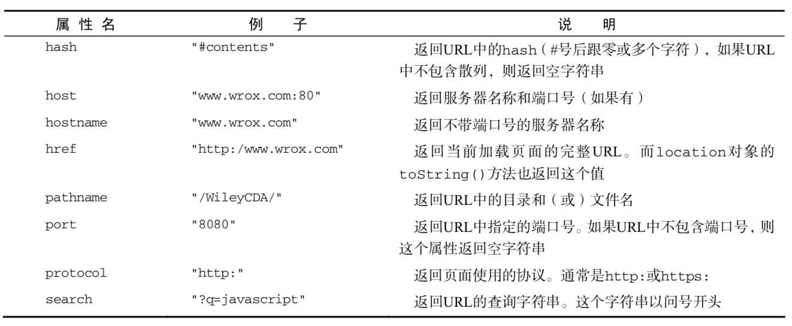

# 第八章 BOM

## window对象

由于 window 对象同时扮演着 ECMAScript 中 Global 对象的角色，因此所有在全局作用域中声明的变量、函数都会变成 window 对象的属性和方法。

### 窗口关系及框架

如果页面中包含框架，则每个框架都拥有自己的 window 对象，并且保存在 frames 集合中。在 frames集合中，可以通过数值索引（从 0 开始，从左至右，从上到下）或者框架名称来访问相应的 window 对象。

### 窗口位置

用来确定和修改 window 对象位置的属性和方法有很多。IE、Safari、Opera 和 Chrome 都提供了screenLeft 和 screenTop 属性，分别用于表示窗口相对于屏幕左边和上边的位置。Firefox 则在screenX 和 screenY 属性中提供相同的窗口位置信息，Safari 和 Chrome 也同时支持这两个属性。Opera虽然也支持 screenX 和 screenY 属性，但与 screenLeft 和 screenTop 属性并不对应，因此建议大家不要在 Opera 中使用它们。

```js
var leftPos = (typeof window.screenLeft == "number") ?
    window.screenLeft : window.screenX;
var topPos = (typeof window.screenTop == "number") ?
    window.screenTop : window.screenY;
```

### 滚动页面

```js
window.scrollTo(xpos, ypos)
window.scrollTo(0, 0) // 返回顶部
```

### 窗口尺寸

```js
var wdith = window.innerWidth
            || document.documentElement.clientWidth
            || document.body.clientWidth;

var height = window.innerHeight
            || document.documentElement.clientHeight
            || document.body.clientHeight;
```

### 定时

```js
//设置延时调用
var timeoutId = setTimeout(function() {
    alert("Hello world!");
}, 1000);
//注意:把它取消
clearTimeout(timeoutId);
```

```js
//设置重复调用
var timeoutId = setInterval(function() {
    alert("Hello world!");
}, 1000);
//注意:把它取消
clearInterval(timeoutId);
```

### 系统对话框

```js
alert("Hello world!") // 警告
if (confirm("Are you sure?")) {
        alert("I'm so glad you're sure! ");
    } else {
        alert("I'm sorry to hear you're not sure. ");
} // 确认
var result = prompt("What is your name? ", "");
    if (result !== null) {
        alert("Welcome, " + result);
    } // 输入
```

## location对象



### 查询字符串参数

```js
function getQueryStringArgs(){
    //取得查询字符串并去掉开头的问号
    var qs = (location.search.length > 0 ? location.search.substring(1) : ""),
    //保存数据的对象
    args = {},
    //取得每一项
    items = qs.length ? qs.split("&") : [],
    item = null,
    name = null,
    value = null,
    //在 for 循环中使用
    i = 0,
    len = items.length;
    //逐个将每一项添加到 args 对象中
    for (i=0; i < len; i++){
        item = items[i].split("=");
        name = decodeURIComponent(item[0]);
        value = decodeURIComponent(item[1]);
        if (name.length) {
            args[name] = value;
        }
    }
    return args;
}
```

### 位置操作

```js
// 以下代码完全一致
location.assign("http://www.wrox.com");
window.location = "http://www.wrox.com";
location.href = "http://www.wrox.com";
```

## navigator对象

`navigator.userAgent` 获得浏览器的用户代理字符串

## screen对象

```js
screen.height // 屏幕的像素高度
screen.width // 屏幕的像素宽度度
screen.left // 当前屏幕距左边的像素距离
screen.top // 当前屏幕距上边的像素距离
```

## history对象

```js
//后退一页
history.go(-1);
//前进一页
history.go(1);
//前进两页
history.go(2);
//后退一页
history.back();
//前进一页
history.forward();
```
