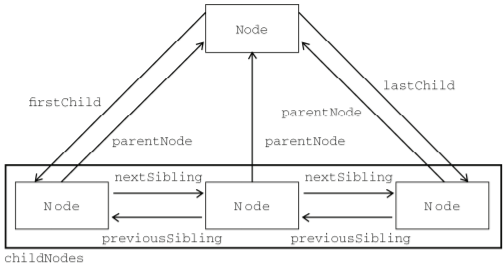

# 第十章 DOM

## Node类型

每个节点都有一个 nodeType 属性，用于表明节点的类型。节点类型由在 Node 类型中定义的下列
12 个数值常量来表示，任何节点类型必居其一：

- Node.ELEMENT_NODE(1)

- Node.ATTRIBUTE_NODE(2)

- Node.TEXT_NODE(3)

- Node.CDATA_SECTION_NODE(4)

- Node.ENTITY_REFERENCE_NODE(5)

- Node.ENTITY_NODE(6)

- Node.PROCESSING_INSTRUCTION_NODE(7)

- Node.COMMENT_NODE(8)

- Node.DOCUMENT_NODE(9)

- Node.DOCUMENT_TYPE_NODE(10)

- Node.DOCUMENT_FRAGMENT_NODE(11)

- Node.NOTATION_NODE(12)

```js
if (someNode.nodeType == 1){ //适用于所有浏览器
    alert("Node is an element.");
}
```

## 节点层次

### 节点关系

每个节点都有一个 childNodes 属性，其中保存着一个 NodeList 对象。NodeList 是一种类数组对象，用于保存一组有序的节点，可以通过位置来访问这些节点。请注意，虽然可以通过方括号语法来访问 NodeList 的值，而且这个对象也有 length 属性，但它并不是 Array 的实例。

如何访问保存在 NodeList 中的节点——可以通过方括号，也可以使用 item()方法。

```js
var firstChild = someNode.childNodes[0]
var secondChild = someNode.childNodes.item(1)
var count = someNode.childNodes.length
```

每个节点都有一个 parentNode 属性，该属性指向文档树中的父节点。包含在 childNodes 列表中的所有节点都具有相同的父节点，因此它们的 parentNode 属性都指向同一个节点。此外，包含在childNodes 列表中的每个节点相互之间都是同胞节点。通过使用列表中每个节点的previousSibling和 nextSibling 属性，可以访问同一列表中的其他节点。列表中第一个节点的 previousSibling 属性值为 null，而列表中最后一个节点的 nextSibling 属性的值同样也为 null，如下面的例子所示：

```js
if (someNode.nextSibling === null) {
    alert("Last node in the parent’s childNodes list.")
} else if (someNode.previousSibling === null) {
    alert("First node in the parent’s childNodes list.")
}
```

父节点与其第一个和最后一个子节点之间也存在特殊关系。父节点的 firstChild 和 lastChild属性分别指向其 childNodes 列表中的第一个和最后一个节点。



### 操作节点

最常用的方法是appendChild()，用于向 childNodes 列表的末尾添加一个节点。

```js
var returnedNode = someNode.appendChild(newNode)
alert(returnedNode == newNode) //true
alert(someNode.lastChild == newNode) //true
```

如果需要把节点放在 childNodes 列表中某个特定的位置上，而不是放在末尾，那么可以使用insertBefore()方法。这个方法接受两个参数：要插入的节点和作为参照的节点。

```js
//插入后成为最后一个子节点
returnedNode = someNode.insertBefore(newNode, null)
alert(newNode == someNode.lastChild) //true
//插入后成为第一个子节点
var returnedNode = someNode.insertBefore(newNode, someNode.firstChild)
alert(returnedNode == newNode) //true
alert(newNode == someNode.firstChild) //true
//插入到最后一个子节点前面
returnedNode = someNode.insertBefore(newNode, someNode.lastChild)
alert(newNode == someNode.childNodes[someNode.childNodes.length-2]) //true
```

replaceChild()方法接受的两个参数是：要插入的节点和要替换的节点。要替换的节点将由这个方法返回并从文档树中被移除，同时由要插入的节点占据其位置。

```js
//移除第一个子节点
var formerFirstChild = someNode.removeChild(someNode.firstChild)
//移除最后一个子节点
var formerLastChild = someNode.removeChild(someNode.lastChild)
```

如果只想移除而非替换节点，可以使用 removeChild()方法。这个方法接受一个参数，即要移除的节点。被移除的节点将成为方法的返回值

```js
//移除第一个子节点
var formerFirstChild = someNode.removeChild(someNode.firstChild)
//移除最后一个子节点
var formerLastChild = someNode.removeChild(someNode.lastChild)
```

## Document类型

```js
//取得文档标题
var originalTitle = document.title
//设置文档标题
document.title = "New page title"
//取得完整的 URL
var url = document.URL
//取得域名
var domain = document.domain
//取得来源页面的 URL
var referrer = document.referrer
// 查找元素
document.getElementById()
document.getElementsByTagName()
document.getElementsByName()
document.getElementsByClassName()
// 文档写入
document.write()
// 取得特性
var div = document.getElementById("myDiv");
alert(div.getAttribute("id")); //"myDiv"
document.setAttribute("class", "ft")
document.removeAttribute("class")
// 创建元素
var div = document.createElement("div")
div.id = "myNewDiv"
document.body.appendChild(div)

```
