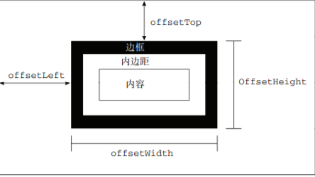
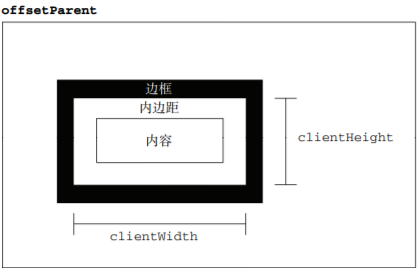

# 第十二章 DOM2和DOM3

## css

对于使用短横线（分隔不同的词汇，例如 background-image）的 CSS 属性名，必须将其转换成小驼峰形式，才能通过 JavaScript 来访问。

```js
var myDiv = document.getElementById("myDiv");
//设置背景颜色
myDiv.style.backgroundColor = "red"
//改变大小
myDiv.style.width = "100px"
myDiv.style.height = "200px"
//指定边框
myDiv.style.border = "1px solid black"
// 在以这种方式改变样式时，元素的外观会自动被更新
```

## 元素大小

### 偏移量

- offsetHeight：元素在垂直方向上占用的空间大小，以像素计。包括元素的高度、（可见的）水平滚动条的高度、上边框高度和下边框高度。

- offsetWidth：元素在水平方向上占用的空间大小，以像素计。包括元素的宽度、（可见的）垂直滚动条的宽度、左边框宽度和右边框宽度。

- offsetLeft：元素的左外边框至包含元素的左内边框之间的像素距离。

- offsetTop：元素的上外边框至包含元素的上内边框之间的像素距离。



`element.offsetTop`

### 客户区大小

元素的客户区大小（client dimension），指的是元素内容及其内边距所占据的空间大小。

- clientWidth 属性是元素内容区宽度加上左右内边距宽度

- clientHeight 属性是元素内容区高度加上上下内边距高度



`element.clientWidth`

### 滚动大小

- scrollHeight：在没有滚动条的情况下，元素内容的总高度

- scrollWidth：在没有滚动条的情况下，元素内容的总宽度

- scrollLeft：被隐藏在内容区域左侧的像素数。通过设置这个属性可以改变元素的滚动位置

- scrollTop：被隐藏在内容区域上方的像素数。通过设置这个属性可以改变元素的滚动位置

## 遍历

- parentNode()：遍历到当前节点的父节点

- firstChild()：遍历到当前节点的第一个子节点

- lastChild()：遍历到当前节点的最后一个子节点

- nextSibling()：遍历到当前节点的下一个同辈节点

- previousSibling()：遍历到当前节点的上一个同辈节点
