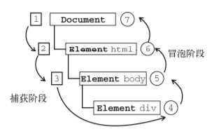
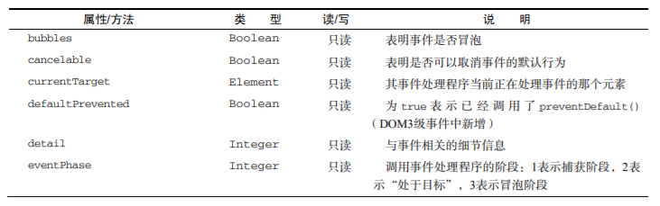
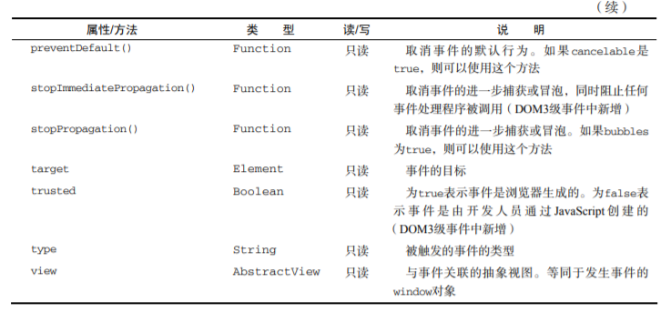

# 第十三章 事件

## 事件流

### 事件冒泡

即事件开始时由最具体的元素（文档中嵌套层次最深的那个节点）接收，然后逐级向上传播到较为不具体的节点（文档）。

### 事件捕获

事件捕获的思想是不太具体的节点应该更早接收到事件，而最具体的节点应该最后接收到事件。事件捕获的用意在于在事件到达预定目标之前捕获它。 **现在几乎不用这种**

### DOM事件流

事件流包括三个阶段：事件捕获阶段、处于目标阶段和事件冒泡阶段。首先发生的是事件捕获，为截获事件提供了机会。然后是实际的目标接收到事件。最后一个阶段是冒泡阶段，可以在这个阶段对事件做出响应。IE8以前不支持



## 事件处理程序

事件就是用户或浏览器自身执行的某种动作。诸如 click、load 和 mouseover，都是事件的名字。而响应某个事件的函数就叫做事件处理程序（或事件侦听器）。

### DOM0 级事件处理程序

```js
var btn = document.getElementById("myBtn")
btn.onclick = function () {
  alert("Clicked")
}
```

### DOM2 级事件处理程序

“DOM2级事件”定义了两个方法，用于处理指定和删除事件处理程序的操作：`addEventListener()`和 `removeEventListener()`。所有 DOM 节点中都包含这两个方法，并且它们都接受 3 个参数：要处理的事件名、作为事件处理程序的函数和一个布尔值。最后这个布尔值参数如果是 true，表示在捕获阶段调用事件处理程序；如果是 false，表示在冒泡阶段调用事件处理程序。

要在按钮上为 `click` 事件添加事件处理程序，可以使用下列代码：

```js
var btn = document.getElementById("myBtn")
btn.addEventListener("click", function () {
  alert(this.id)
}, false)
```

## 事件对象

在触发 DOM 上的某个事件时，会产生一个事件对象 event，这个对象中包含着所有与事件有关的信息。包括导致事件的元素、事件的类型以及其他与特定事件相关的信息。

### DOM中的事件对象

兼容 DOM 的浏览器会将一个 event 对象传入到事件处理程序中。无论指定事件处理程序时使用什么方法（DOM0 级或 DOM2 级），都会传入 event 对象。

```js
var btn = document.getElementById("myBtn");
btn.onclick = function (event) {
  alert(event.type) //"click"
}
btn.addEventListener("click", function (event) {
  alert(event.type) //"click"
}, false)
```

event 对象包含与创建它的特定事件有关的属性和方法。触发的事件类型不一样，可用的属性和方法也不一样。不过，所有事件都会有下表列出的成员。





## 事件类型

Web 浏览器中可能发生的事件有很多类型。如前所述，不同的事件类型具有不同的信息，而“DOM3
级事件”规定了以下几类事件。

- UI（User Interface，用户界面）事件，当用户与页面上的元素交互时触发；

- 焦点事件，当元素获得或失去焦点时触发；

- 鼠标事件，当用户通过鼠标在页面上执行操作时触发；

- 滚轮事件，当使用鼠标滚轮（或类似设备）时触发；

- 文本事件，当在文档中输入文本时触发；

- 键盘事件，当用户通过键盘在页面上执行操作时触发；

- 合成事件，当为 IME（Input Method Editor，输入法编辑器）输入字符时触发；

- 变动（mutation）事件，当底层 DOM 结构发生变化时触发。

除了这几类事件之外，HTML5 也定义了一组事件，而有些浏览器还会在 DOM 和 BOM 中实现其他专有事件。这些专有的事件一般都是根据开发人员需求定制的，没有什么规范，因此不同浏览器的实现有可能不一致。

DOM3 级事件模块在 DOM2 级事件模块基础上重新定义了这些事件，也添加了一些新事件。包括IE9 在内的所有主流浏览器都支持 DOM2 级事件。IE9 也支持 DOM3 级事件。

### UI事件

- load：当页面完全加载后在 window 上面触发，当所有框架都加载完毕时在框架集上面触发，当图像加载完毕时在``元素上面触发

- unload：当页面完全卸载后在 window 上面触发，当所有框架都卸载后在框架集上面触发

- select：当用户选择文本框（`<input>`或`<texterea>`）中的一或多个字符时触发。

- resize：当窗口或框架的大小变化时在 window 或框架上面触发。

- scroll：当用户滚动带滚动条的元素中的内容时，在该元素上面触发。`<body>`元素中包含所加载页面的滚动条。

多数这些事件都与 window 对象或表单控件相关。

### 焦点事件

焦点事件会在页面元素获得或失去焦点时触发。利用这些事件并与 `document.hasFocus()`方法及`document.activeElement` 属性配合，可以知晓用户在页面上的行踪。

- blur：在元素失去焦点时触发。这个事件不会冒泡；所有浏览器都支持它。

- focus：在元素获得焦点时触发。这个事件不会冒泡；所有浏览器都支持它。

### 鼠标与滚轮事件

- click：在用户单击主鼠标按钮（一般是左边的按钮）或者按下回车键时触发。这一点对确保易访问性很重要，意味着 onclick 事件处理程序既可以通过键盘也可以通过鼠标执行。

- dblclick：在用户双击主鼠标按钮（一般是左边的按钮）时触发。从技术上说，这个事件并不是 DOM2 级事件规范中规定的，但鉴于它得到了广泛支持，所以 DOM3 级事件将其纳入了标准。

- mousedown：在用户按下了任意鼠标按钮时触发。不能通过键盘触发这个事件。

- mouseenter：在鼠标光标从元素外部首次移动到元素范围之内时触发。这个事件不冒泡，而且在光标移动到后代元素上不会触发。DOM2 级事件并没有定义这个事件，但 DOM3 级事件将它纳入了规范。IE、Firefox 9+和 Opera 支持这个事件。

- mouseleave：在位于元素上方的鼠标光标移动到元素范围之外时触发。这个事件不冒泡，而且在光标移动到后代元素上不会触发。DOM2 级事件并没有定义这个事件，但 DOM3 级事件将它纳入了规范。IE、Firefox 9+和 Opera 支持这个事件。

- mousemove：当鼠标指针在元素内部移动时重复地触发。不能通过键盘触发这个事件。

- mouseout：在鼠标指针位于一个元素上方，然后用户将其移入另一个元素时触发。又移入的另一个元素可能位于前一个元素的外部，也可能是这个元素的子元素。不能通过键盘触发这个事件。

- mouseover：在鼠标指针位于一个元素外部，然后用户将其首次移入另一个元素边界之内时触发。不能通过键盘触发这个事件。

- mouseup：在用户释放鼠标按钮时触发。不能通过键盘触发这个事件。

1. 客户区坐标位置

    鼠标事件都是在浏览器视口中的特定位置上发生的。这个位置信息保存在事件对象的 clientX 和clientY 属性中。所有浏览器都支持这两个属性，它们的值表示事件发生时鼠标指针在视口中的水平和垂直坐标。

    ```js
    event.clientX
    event.clientY
    ```

2. 页面坐标位置

    ```js
    pageX = event.clientX + document.body.scrollLeft
    pageY = event.clientY + document.body.scrollTop
    ```

3. 屏幕坐标位置

    ```js
    event.screenX
    event.screenY
    ```

### 键盘与文本事件

- keydown：当用户按下键盘上的任意键时触发，而且如果按住不放的话，会重复触发此事件。

- keypress：当用户按下键盘上的字符键时触发，而且如果按住不放的话，会重复触发此事件。按下 Esc 键也会触发这个事件。Safari 3.1 之前的版本也会在用户按下非字符键时触发 keypress事件。

- keyup：当用户释放键盘上的键时触发。
