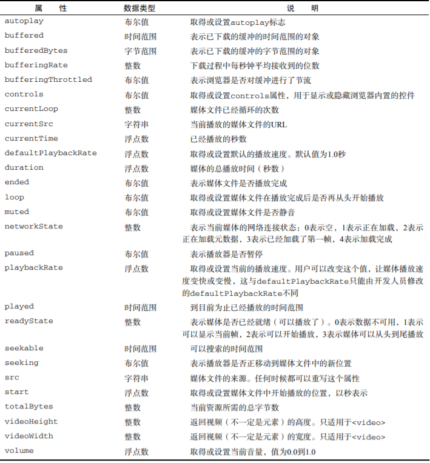
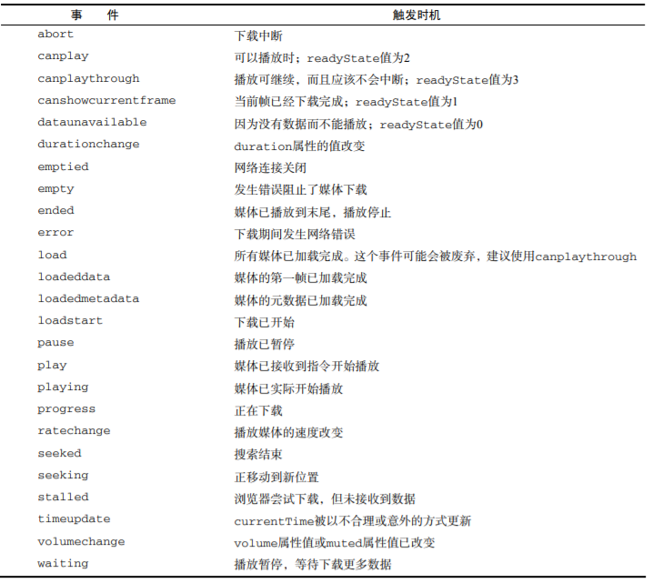

# 第十六章 HTML5 脚本编程

## 跨文档消息传递

跨文档消息传送（cross-document messaging），有时候简称为 XDM，指的是在来自不同域的页面间传递消息。例如，www.wrox.com 域中的页面与位于一个内嵌框架中的 p2p.wrox.com 域中的页面通信。在 XDM 机制出现之前，要稳妥地实现这种通信需要花很多工夫。XDM 把这种机制规范化，让我们能既稳妥又简单地实现跨文档通信。

## 原生拖放

### 拖放事件

拖动某元素时，将依次触发下列事件：

1. dragstart
2. drag
3. dragend

当某个元素被拖动到一个有效的放置目标上时，下列事件会依次发生：

1. dragenter
2. dragover
3. dragleave 或 drop

### 自定义放置目标

在拖动元素经过某些无效放置目标时，可以看到一种特殊的光标（圆环中有一条反斜线），表示不能放置。虽然所有元素都支持放置目标事件，但这些元素默认是不允许放置的。如果拖动元素经过不允许放置的元素，无论用户如何操作，都不会发生 drop 事件。不过，你可以把任何元素变成有效的放置目标，方法是重写 dragenter 和 dragover 事件的默认行为。例如，假设有一个 ID 为"droptarget"的`<div>`元素，可以用如下代码将它变成一个放置目标。

```js
var droptarget = document.getElementById("droptarget");
EventUtil.addHandler(droptarget, "dragover", function(event) {
  EventUtil.preventDefault(event);
});
EventUtil.addHandler(droptarget, "dragenter", function(event) {
  EventUtil.preventDefault(event);
});
```

### dataTransfer对象

dataTransfer 对象有两个主要方法：getData()和 setData()。不难想象，getData()可以取得由 setData()保存的值。setData()方法的第一个参数，也是 getData()方法唯一的一个参数，是一个字符串，表示保存的数据类型，取值为"text"或"URL"，如下所示：

```js
//设置和接收文本数据
event.dataTransfer.setData("text", "some text");
var text = event.dataTransfer.getData("text");
//设置和接收 URL
event.dataTransfer.setData("URL", "http://www.wrox.com/");
var url = event.dataTransfer.getData("URL");
```

### dropEffect与effectAllowed

利用 dataTransfer 对象，可不光是能够传输数据，还能通过它来确定被拖动的元素以及作为放置目标的元素能够接收什么操作。为此，需要访问 dataTransfer 对象的两个属性：dropEffect 和effectAllowed。

其中，通过 dropEffect 属性可以知道被拖动的元素能够执行哪种放置行为。这个属性有下列 4个可能的值。

- "none"：不能把拖动的元素放在这里。这是除文本框之外所有元素的默认值。

- "move"：应该把拖动的元素移动到放置目标。

- "copy"：应该把拖动的元素复制到放置目标。

- "link"：表示放置目标会打开拖动的元素（但拖动的元素必须是一个链接，有 URL）。

### 可拖动

```html
<!-- 让这个图像不可以拖动 -->

<!-- 让这个元素可以拖动 -->
<div draggable="true">...</div>
```

## 媒体元素

```html
<!-- 嵌入视频 -->
<video id="myVideo">
 <source src="conference.webm" type="video/webm; codecs='vp8, vorbis'">
 <source src="conference.ogv" type="video/ogg; codecs='theora, vorbis'">
 <source src="conference.mpg">
 Video player not available.
</video>
<!-- 嵌入音频 -->
<audio id="myAudio">
 <source src="song.ogg" type="audio/ogg">
 <source src="song.mp3" type="audio/mpeg">
 Audio player not available.
</audio>
```

### 属性



### 事件



### 自定义媒体播放器

```html
<div class="mediaplayer">
  <div class="video">
    <video id="player" src="movie.mov" poster="mymovie.jpg" width="300" height="200">
      Video player not available.
    </video>
  </div>
  <div class="controls">
    <input type="button" value="Play" id="video-btn">
    <span id="curtime">0</span>/<span id="duration">0</span>
  </div>
</div>
```

```js
//取得元素的引用
var player = document.getElementById("player"),
    btn = document.getElementById("video-btn"),
    curtime = document.getElementById("curtime"),
    duration = document.getElementById("duration");
// 更新播放时间
duration.innerHTML = player.duration;
// 为按钮添加事件处理程序
EventUtil.addHandler(btn, "click", function(event) {
  if (player.paused) {
    player.play();
    btn.value = "Pause";
  } else {
    player.pause();
    btn.value = "Play";
  }
});
// 定时更新当前时间
setInterval(function() {
  curtime.innerHTML = player.currentTime;
}, 250);
```

以上 JavaScript 代码给按钮添加了一个事件处理程序，单击它能让视频在暂停时播放，在播放时暂停。通过`<video>`元素的 load 事件处理程序，设置了加载完视频后显示播放时间。最后，设置了一个计时器，以更新当前显示的时间。
