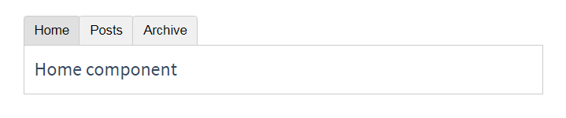
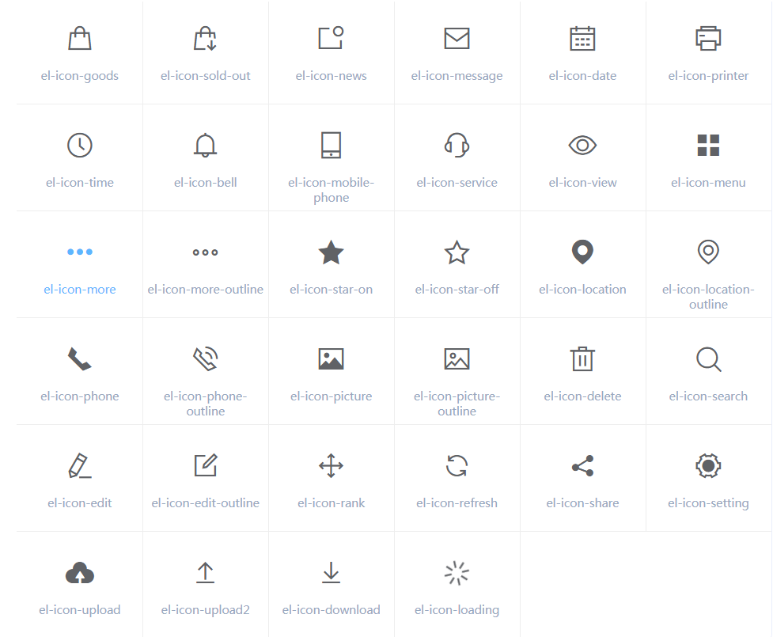
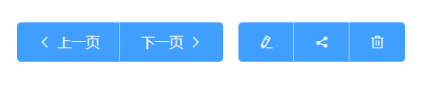

# vue

`https://cdn.staticfile.org/vue/2.6.10/vue.js`

`https://cdn.staticfile.org/vuex/3.1.0/vuex.js`

`https://cdn.staticfile.org/vue-router/3.0.2/vue-router.js`

`https://cdn.staticfile.org/axios/0.18.0/axios.js`

`https://cdn.staticfile.org/vue-resource/1.5.1/vue-resource.js`

`https://cdn.staticfile.org/vue/2.6.10/vue.min.js`

`https://cdn.staticfile.org/vuex/3.1.0/vuex.min.js`

`https://cdn.staticfile.org/vue-router/3.0.2/vue-router.min.js`

`https://cdn.staticfile.org/vue-resource/1.5.1/vue-resource.min.js`

`https://cdn.staticfile.org/axios/0.18.0/axios.min.js`

`https://unpkg.com/element-ui/lib/theme-chalk/index.css`

`https://unpkg.com/element-ui/lib/index.js`


## vue指令

### 基本指令

1. v-cloak

    这个指令保持在元素上直到关联实例结束编译。和 CSS 规则如 [v-cloak] { display: none } 一起用时，这个指令可以隐藏未编译的 Mustache 标签直到实例准备完毕。

    ```html
    [v-cloak] {
        display: none;
    }
    <div v-cloak>
        {{ message }}
    </div>
    ```

2. v-text v-html

    v-text:更新元素的 textContent。如果要更新部分的 textContent ，需要使用 {{ Mustache }} 插值。

    ```html
    <span v-text="msg"></span>
    <!-- 和下面的一样 -->
    <span>{{msg}}</span>
    ```

    v-html:更新元素的 innerHTML 。注意：内容按普通 HTML 插入 - 不会作为 Vue 模板进行编译 。如果试图使用 v-html 组合模板，可以重新考虑是否通过使用组件来替代。

    在网站上动态渲染任意 HTML 是非常危险的，因为容易导致 XSS 攻击。只在可信内容上使用 v-html，永不用在用户提交的内容上。

    `<div v-html="html"></div>`

3. v-show

    根据表达式之真假值，切换元素的 display CSS 属性。

    当条件变化时该指令触发过渡效果。

4. v-if else

    v-if:根据表达式的值的真假条件渲染元素。在切换时元素及它的数据绑定 / 组件被销毁并重建。如果元素是 `<template>` ，将提出它的内容作为条件块。

    当和 v-if 一起使用时，v-for 的优先级比 v-if 更高。

    v-else:不需要表达式 为 v-if 或者 v-else-if 添加“else 块”。

    v-else-if:表示 v-if 的 “else if 块”。可以链式调用。

    >一般来说，v-if 有更高的切换消耗而 v-show 有更高的初始渲染消耗。因此，如果需要频繁切换 v-show 较好，如果在运行时条件不大可能改变 v-if 较好。

5. v-for

    基于源数据多次渲染元素或模板块。此指令之值，必须使用特定语法 alias in expression ，为当前遍历的元素提供别名

    ```html
    <div v-for="item in items">
      {{ item.text }}
    </div>
    <!-- 另外也可以为数组索引指定别名 (或者用于对象的键) -->
    <div v-for="(item, index) in items"></div>
    <div v-for="(val, key) in object"></div>
    <div v-for="(val, key, index) in object"></div>
    <!-- v-for 默认行为试着不改变整体，而是替换元素。迫使其重新排序的元素，你需要提供一个 key 的特殊属性 -->
    <div v-for="item in items" :key="item.id">
      {{ item.text }}
    </div>
    ```

6. v-on

    - 缩写：@

    - 预期：Function | Inline Statement | Object

    - 参数：event

    - 修饰符：

        .stop - 调用 event.stopPropagation()。

        .prevent - 调用 event.preventDefault()。

        .capture - 添加事件侦听器时使用 capture 模式。

        .self - 只当事件是从侦听器绑定的元素本身触发时才触发回调。

        .{keyCode | keyAlias} - 只当事件是从特定键触发时才触发回调。

        .native - 监听组件根元素的原生事件。

        .once - 只触发一次回调。

        .left - (2.2.0) 只当点击鼠标左键时触发。

        .right - (2.2.0) 只当点击鼠标右键时触发。

        .middle - (2.2.0) 只当点击鼠标中键时触发。

        .passive - (2.3.0) 以 { passive: true } 模式添加侦听器

    - 用法:

        绑定事件监听器。事件类型由参数指定。表达式可以是一个方法的名字或一个内联语句，如果没有修饰符也可以省略。

        用在普通元素上时，只能监听原生 DOM 事件。用在自定义元素组件上时，也可以监听子组件触发的自定义事件。

        在监听原生 DOM 事件时，方法以事件为唯一的参数。如果使用内联语句，语句可以访问一个 $event 属性：v-on:click="handle('ok', $event)"。

        从 2.4.0 开始，v-on 同样支持不带参数绑定一个事件/监听器键值对的对象。注意当使用对象语法时，是不支持任何修饰器的。

    ```html
    <button v-on:click="doThis"></button><!-- 方法处理器 -->
    <button v-on:[event]="doThis"></button><!-- 动态事件 (2.6.0+) -->
    <button v-on:click="doThat('hello', $event)"></button><!-- 内联语句 -->
    <button @click="doThis"></button><!-- 缩写 -->
    <button @[event]="doThis"></button><!-- 动态事件缩写 (2.6.0+) -->
    <button @click.stop="doThis"></button><!-- 停止冒泡 -->
    <button @click.prevent="doThis"></button><!-- 阻止默认行为 -->
    <form @submit.prevent></form><!-- 阻止默认行为，没有表达式 -->
    <button @click.stop.prevent="doThis"></button><!--  串联修饰符 -->
    <input @keyup.enter="onEnter"><!-- 键修饰符，键别名 -->
    <input @keyup.13="onEnter"><!-- 键修饰符，键代码 -->
    <button v-on:click.once="doThis"></button><!-- 点击回调只会触发一次 -->
    <button v-on="{ mousedown: doThis, mouseup: doThat }"></button><!-- 对象语法 (2.4.0+) -->
    ```

    在子组件上监听自定义事件 (当子组件触发“my-event”时将调用事件处理器)：

    ```html
    <my-component @my-event="handleThis"></my-component>
    <my-component @my-event="handleThis(123, $event)"></my-component><!-- 内联语句 -->
    <my-component @click.native="onClick"></my-component><!-- 组件中的原生事件 -->
    ```

    示例:跑马灯

    ```html
    <div id="app">
        <p>{{info}}</p>
        <input type="button" value="开启" @click="go">
        <input type="button" value="停止" @click="stop">
    </div>
    <script>
        var vm = new Vue({
            el: "#app",
            data: {
                info: "猥琐发育,别浪",
                intervalId: null
            },
            methods: {
                go(){
                    if (this.intervalId != null) return;
                    this.intervalId = setInterval(()=>{
                        this.info = this.info.substring(1) + this.info.substring(0, 1);
                    },500);
                },
                stop(){
                    clearInterval(this.intervalId);
                    this.intervalId = null;
                }
            }
        });
    </script>
    ```

7. v-bind

    - 缩写：:

    - 预期：any (with argument) | Object (without argument)

    - 参数：attrOrProp (optional)

    - 修饰符：

        .prop - 被用于绑定 DOM 属性 (property)。(差别在哪里？)

        .camel - (2.1.0+) 将 kebab-case 特性名转换为 camelCase. (从 2.1.0 开始支持)

        .sync (2.3.0+) 语法糖，会扩展成一个更新父组件绑定值的 v-on 侦听器。

    - 用法：

        动态地绑定一个或多个特性，或一个组件 prop 到表达式。

        在绑定 class 或 style 特性时，支持其它类型的值，如数组或对象。可以通过下面的教程链接查看详情。

        在绑定 prop 时，prop 必须在子组件中声明。可以用修饰符指定不同的绑定类型。

        没有参数时，可以绑定到一个包含键值对的对象。注意此时 class 和 style 绑定不支持数组和对象。

    ```html
    <!-- 绑定一个属性 -->
    <button v-bind:[key]="value"></button><!-- 动态特性名 (2.6.0+) -->
    <!-- 缩写 -->
    <button :[key]="value"></button><!-- 动态特性名缩写 (2.6.0+) -->
    <!-- 内联字符串拼接 -->
    <div :class="{ red: isRed }"></div><!-- class 绑定 -->
    <div :class="[classA, classB]"></div>
    <div :class="[classA, { classB: isB, classC: isC }]">
    <div :style="{ fontSize: size + 'px' }"></div><!-- style 绑定 -->
    <div :style="[styleObjectA, styleObjectB]"></div>
    <div v-bind="{ id: someProp, 'other-attr': otherProp }"></div><!-- 绑定一个有属性的对象 -->
    <div v-bind:text-content.prop="text"></div><!-- 通过 prop 修饰符绑定 DOM 属性 -->
    <my-component :prop="someThing"></my-component><!-- prop 绑定。“prop”必须在 my-component 中声明。-->
    <child-component v-bind="$props"></child-component><!-- 通过 $props 将父组件的 props 一起传给子组件 -->
    <svg><a :xlink:special="foo"></a></svg><!-- XLink -->
    ```

    .camel 修饰符允许在使用 DOM 模板时将 v-bind 属性名称驼峰化，例如 SVG 的 viewBox 属性：

    `<svg :view-box.camel="viewBox"></svg>`

    在使用字符串模板或通过 vue-loader/vueify 编译时，无需使用 .camel。

8. v-model

    - 预期：随表单控件类型不同而不同。

    - 限制：

        `<input>`

        `<select>`

        `<textarea>`

        `components`

    - 修饰符：

        .lazy - 取代 input 监听 change 事件

        .number - 输入字符串转为有效的数字

        .trim - 输入首尾空格过滤

    - 用法：在表单控件或者组件上创建双向绑定。

    > v-bind 只能实现数据的单向绑定，从 M 自动绑定到 V， 无法实现数据的双向绑定
    > v-model 指令，可以实现 表单元素和 Model 中数据的双向数据绑定
    > v-model 只能运用在 表单元素中

### 自定义指令

> 除了核心功能默认内置的指令 (v-model 和 v-show)，Vue 也允许注册自定义指令。注意，在 Vue2.0 中，代码复用和抽象的主要形式是组件。然而，有的情况下，你仍然需要对普通 DOM 元素进行底层操作，这时候就会用到自定义指令。

```js
// 注册一个全局自定义指令 `v-focus`
Vue.directive('focus', {
  // 当被绑定的元素插入到 DOM 中时……
  inserted: function (el) {
    // 聚焦元素
    el.focus()
  }
})
```

如果想注册局部指令，组件中也接受一个 directives 的选项

```js
directives: {
  focus: {
    // 指令的定义
    inserted: function (el) {
      el.focus()
    }
  }
}
```

可以在模板中任何元素上使用新的 `v-focus` 属性:`<input v-focus>`

## 过滤器

>Vue.js 允许你自定义过滤器，**可被用作一些常见的文本格式化**。过滤器可以用在两个地方：**mustache 插值和 v-bind 表达式**。过滤器应该被添加在 JavaScript 表达式的尾部，由“管道”符指示；

```html
{{ message | capitalize }}<!-- 在双花括号中 -->
<div v-bind:id="rawId | formatId"></div><!-- 在 v-bind 中 -->
```

### 私有过滤器

可以在一个组件的选项中定义本地的过滤器

```js
filters: {// 私有局部过滤器，只能在 当前 VM 对象所控制的 View 区域进行使用
  capitalize: function (value) {
    if (!value) return ''
    value = value.toString()
    return value.charAt(0).toUpperCase() + value.slice(1)
  }
}
```

### 全局过滤器

```js
// 在创建 Vue 实例之前全局定义过滤器
Vue.filter('capitalize', function (value) {
  if (!value) return ''
  value = value.toString()
  return value.charAt(0).toUpperCase() + value.slice(1)
})
new Vue({
  // ...
})
```

注意：当有局部和全局两个名称相同的过滤器时候，会以就近原则进行调用，即：局部过滤器优先于全局过滤器被调用！

### 过滤器的串联

过滤器函数总接收表达式的值 (之前的操作链的结果) 作为第一个参数。在上述例子中，capitalize 过滤器函数将会收到 message 的值作为第一个参数。

```html
{{ message | filterA | filterB }}
```

filterA 被定义为接收单个参数的过滤器函数，表达式 message 的值将作为参数传入到函数中。然后继续调用同样被定义为接收单个参数的过滤器函数 filterB，将 filterA 的结果传递到 filterB 中。

过滤器是 JavaScript 函数，因此可以接收参数：

```html
{{ message | filterA('arg1', arg2) }}
```

filterA 被定义为接收三个参数的过滤器函数。其中 message 的值作为第一个参数，普通字符串 'arg1' 作为第二个参数，表达式 arg2 的值作为第三个参数。

## Vue的生命周期

> 所有的生命周期钩子自动绑定 this 上下文到实例中，因此你可以访问数据，对属性和方法进行运算。这意味着你不能使用箭头函数来定义一个生命周期方法 (例如 created: () => this.fetchTodos())。这是因为箭头函数绑定了父上下文，因此 this 与你期待的 Vue 实例不同，this.fetchTodos 的行为未定义。

- 什么是生命周期：从Vue实例创建、运行、到销毁期间，总是伴随着各种各样的事件，这些事件，统称为生命周期！

- [生命周期钩子](https://cn.vuejs.org/v2/api/#选项-生命周期钩子)：就是生命周期事件的别名而已；

- 生命周期钩子 = 生命周期函数 = 生命周期事件

### 1. 创建期间的生命周期函数

- beforeCreate：实例刚在内存中被创建出来，此时，还没有初始化好 data 和 methods 属性

- created：实例已经在内存中创建OK，此时 data 和 methods 已经创建OK，此时还没有开始 编译模板

- beforeMount：此时已经完成了模板的编译，但是还没有挂载到页面中

- mounted：此时，已经将编译好的模板，挂载到了页面指定的容器中显示

### 2. 运行期间的生命周期函数

- beforeUpdate：状态更新之前执行此函数， 此时 data 中的状态值是最新的，但是界面上显示的 数据还是旧的，因为此时还没有开始重新渲染DOM节点

- updated：实例更新完毕之后调用此函数，此时 data 中的状态值 和 界面上显示的数据，都已经完成了更新，界面已经被重新渲染好了！

### 3. 销毁期间的生命周期函数

- beforeDestroy：实例销毁之前调用。在这一步，实例仍然完全可用。

- destroyed：Vue 实例销毁后调用。调用后，Vue 实例指示的所有东西都会解绑定，所有的事件监听器会被移除，所有的子实例也会被销毁。


## 组件

### 组件与复用

```html
<div id="components-demo">
  <button-counter></button-counter>
</div>
<script>
  // 定义一个名为 button-counter 的新组件
  Vue.component('button-counter', {
    data: function () {
      return {
        count: 0
      }
    },
    template: '<button v-on:click="count++">You clicked me {{ count }} times.</button>'
  })
  new Vue({ el: '#components-demo' })
</script>
```

组件是可复用的 Vue 实例，且带有一个名字 名字以短横线分割

因为组件是可复用的 `Vue` 实例，所以它们与 `new Vue` 接收相同的选项，例如 `data`、`computed`、`watch`、`methods` 以及生命周期钩子等。仅有的例外是像 `el` 这样根实例特有的选项。

你可以将组件进行任意次数的复用

一个组件的`data`选项必须是一个函数，因此每个实例可以维护一份被返回对象的独立的拷贝

为了能在模板中使用，这些组件必须先注册以便`Vue`能够识别。这里有两种组件的注册类型：全局注册和局部注册。至此，我们的组件都只是通过`Vue.component`全局注册的,全局注册的组件可以用在其被注册之后的任何 (通过`new Vue`)新创建的`Vue`根实例，也包括其组件树中的所有子组件的模板中。

```js
// 局部注册
var ComponentA = { /* ... */ }
var ComponentB = { /* ... */ }
var ComponentC = { /* ... */ }
new Vue({
  el: '#app',
  components: {
    'component-a': ComponentA,
    'component-b': ComponentB
  }
})
```

局部注册的组件在其子组件中不可用。例如，如果你希望 ComponentA 在 ComponentB 中可用，则你需要这样写:

```js
var ComponentA = { /* ... */ }
var ComponentB = {
  components: {
    'component-a': ComponentA
  },
  // ...
}
```

或者如果你通过 Babel 和 webpack 使用 ES2015 模块，那么代码看起来更像：

```js
import ComponentA from './ComponentA.vue'
export default {
  components: {
    ComponentA
  },
  // ...
}
```

### 使用props传递数据

`Prop` 是你可以在组件上注册的一些自定义特性。当一个值传递给一个 `prop` 特性的时候，它就变成了那个组件实例的一个属性。

一个组件默认可以拥有任意数量的`prop`，任何值都可以传递给任何`prop`。在上述模板中，你会发现我们能够在组件实例中访问这个值，就像访问`data`中的值一样。

```html
<blog-post title="My journey with Vue"></blog-post>
<blog-post title="Blogging with Vue"></blog-post>
<blog-post title="Why Vue is so fun"></blog-post>
<script>
  Vue.component('blog-post', {
    props: ['title'],
    template: '<h3>{{ title }}</h3>'
  })
</script>
```

然而在一个典型的应用中，你可能在 data 里有一个博文的数组,并想要为每篇博文渲染一个组件

发现我们可以使用 v-bind 来动态传递 prop。这在你一开始不清楚要渲染的具体内容，比如从一个 API 获取博文列表的时候，是非常有用的

```html
<blog-post
  v-for="post in posts"
  v-bind:key="post.id"
  v-bind:title="post.title"
></blog-post>
<script>
  new Vue({
    el: '#blog-post-demo',
    data: {
      posts: [
        { id: 1, title: 'My journey with Vue' },
        { id: 2, title: 'Blogging with Vue' },
        { id: 3, title: 'Why Vue is so fun' }
      ]
    }
  })
</script>
```

当你使用 DOM 中的模板时，camelCase (驼峰命名法) 的 prop 名需要使用其等价的 kebab-case (短横线分隔命名) 命名,如果你使用字符串模板，那么这个限制就不存在了

```js
// 可以以对象形式列出prop各自的名称和类型
props: {
  title: String,
  likes: Number,
  isPublished: Boolean,
  commentIds: Array,
  author: Object,
  callback: Function,
  contactsPromise: Promise // or any other constructor
}
```

任何类型的值都可以传给一个 prop

```html
<blog-post title="My journey with Vue"></blog-post> <!-- 给 prop 传入一个静态的值 -->
<blog-post v-bind:title="post.title"></blog-post> <!-- 动态赋予一个变量的值 -->
<blog-post v-bind:title="post.title + ' by ' + post.author.name"
></blog-post><!-- 动态赋予一个复杂表达式的值 -->
<blog-post v-bind:likes="42"></blog-post> <!-- 传入一个数字 -->
<blog-post v-bind:is-published="false"></blog-post> <!-- 传入一个布尔值 -->
<blog-post v-bind:comment-ids="[234, 266, 273]"></blog-post> <!-- 传入一个数组 -->
<blog-post
  v-bind:author="{
    name: 'Veronica',
    company: 'Veridian Dynamics'
  }"
></blog-post> <!-- 传入一个对象 -->
<blog-post v-bind="post"></blog-post> <!-- 传入一个对象的所有属性,使用不带参数的 v-bind -->
```

所有的 prop 都使得其父子 prop 之间形成了一个单向下行绑定：父级 prop 的更新会向下流动到子组件中，但是反过来则不行。

有两种常见的试图改变一个 prop 的情形：

  1. 这个 prop 用来传递一个初始值；这个子组件接下来希望将其作为一个本地的 prop 数据来使用。在这种情况下，最好定义一个本地的 data 属性并将这个 prop 用作其初始值：

      ```js
      props: ['initialCounter'],
      data: function () {
        return {
          counter: this.initialCounter
        }
      }
      ```

  2. 这个 prop 以一种原始的值传入且需要进行转换。在这种情况下，最好使用这个 prop 的值来定义一个计算属性：

      ```js
      props: ['size'],
      computed: {
        normalizedSize: function () {
          return this.size.trim().toLowerCase()
        }
      }
      ```

可以为组件的 prop 指定验证要求，为了定制 prop 的验证方式，你可以为 props 中的值提供一个带有验证需求的对象，而不是一个字符串数组

```js
Vue.component('my-component', {
  props: {
    propA: Number,// 基础的类型检查 (`null` 和 `undefined` 会通过任何类型验证)
    propB: [String, Number],// 多个可能的类型
    propC: {// 必填的字符串
      type: String,
      required: true
    },
    propD: {// 带有默认值的数字
      type: Number,
      default: 100
    },
    propE: {// 带有默认值的对象
      type: Object,
      default: function () {// 对象或数组默认值必须从一个工厂函数获取
        return { message: 'hello' }
      }
    },
    propF: {// 自定义验证函数
      validator: function (value) {
        // 这个值必须匹配下列字符串中的一个
        return ['success', 'warning', 'danger'].indexOf(value) !== -1
      }
    }
  }
})
```

那些 prop 会在一个组件实例创建之前进行验证，所以实例的属性 (如 data、computed 等) 在 default 或 validator 函数中是不可用的。

type 可以是下列原生构造函数中的一个：String/Number/Boolean/Array/Object/Date/Function/Symbol/自定义构造函数

对于绝大多数特性来说，从外部提供给组件的值会替换掉组件内部设置好的值。class 和 style 特性会稍微智能一些，即两边的值会被合并起来，从而得到最终的值

### 自定义事件

v-on可用于监听DOM事件,还可用于组件之间的自定义事件,子组件用$emit来触发事件,父组件用$on()来监听子组件的事件

父组件也可直接在子组件的自定义标签上使用v-on来监听子组件触发的自定义事件 `$emit('自定义事件名',传递的数据0-无限多个)`

`v-on`在组件上监听原生事件用`.native`修饰符 `v-on:click.native=""`

还可在自定义组件上使用`v-model` 一个组件上的 v-model 默认会利用名为 value 的 prop 和名为 input 的事件，但是像单选框、复选框等类型的输入控件可能会将 value 特性用于不同的目的。model 选项可以用来避免这样的冲突

```html
<base-checkbox v-model="lovingVue"></base-checkbox>
<script>
  Vue.component('base-checkbox', {
    model: {
      prop: 'checked',
      event: 'change'
    },
    props: {},
    template: ``
  })
</script>
```

这里的lovingVue的值将会传入这个名为`checked`的`prop`。同时当`<base-checkbox>`触发一个`change`事件并附带一个新的值的时候，这个lovingVue的属性将会被更新

可能需要对一个 prop 进行“双向绑定”。不幸的是，真正的双向绑定会带来维护上的问题，因为子组件可以修改父组件，且在父组件和子组件都没有明显的改动来源。这也是为什么我们推荐以 update:myPropName 的模式触发事件取而代之。

在一个包含 title prop 的假设的组件中，我们可以用以下方法表达对其赋新值的意图：`this.$emit('update:title', newTitle)`

然后父组件可以监听那个事件并根据需要更新一个本地的数据属性。

```html
<text-document
  v-bind:title="doc.title"
  v-on:update:title="doc.title = $event"
></text-document>
```

为了方便起见，我们为这种模式提供一个缩写，即 `.sync` 修饰符：`<text-document v-bind.sync="doc"></text-document>`

这样会把 doc 对象中的每一个属性 (如 title) 都作为一个独立的 prop 传进去，然后各自添加用于更新的 v-on 监听器。

将 `v-bind.sync` 用在一个字面量的对象上，例如 `v-bind.sync=”{ title: doc.title }”`，是无法正常工作的，因为在解析一个像这样的复杂表达式的时候，有很多边缘情况需要考虑。

### 组件通信总结

#### 1.props和$emit-父子通信

父组件向子组件传递数据是通过prop传递的，子组件传递数据给父组件是通过$emit触发事件来做到的。

```js
Vue.component('child',{
    data(){
        return {
            mymessage:this.message
        }
    },
    template:`
        <div>
            <input type="text" v-model="mymessage" @input="passData(mymessage)"> </div>
    `,
    props:['message'],//得到父组件传递过来的数据
    methods:{
        passData(val){
            //触发父组件中的事件
            this.$emit('getChildData',val)
        }
    }
})
Vue.component('parent',{
    template:`
        <div>
            <p>this is parent compoent!</p>
            <child :message="message" v-on:getChildData="getChildData"></child>
        </div>
    `,
    data(){
        return {
            message:'hello'
        }
    },
    methods:{
        //执行子组件触发的事件
        getChildData(val){
            console.log(val)
        }
    }
})
var app=new Vue({
    el:'#app',
    template:`
        <div>
            <parent></parent>
        </div>
    `
})
```

在上面的例子中，有父组件parent和子组件child。

1).父组件传递了message数据给子组件，并且通过v-on绑定了一个getChildData事件来监听子组件的触发事件；

2).子组件通过props得到相关的message数据,最后通过this.$emit触发了getChildData事件。

#### 2.$attrs和$listeners-跨级通信

第一种方式处理父子组件之间的数据传输有一个问题：如果父组件A下面有子组件B，组件B下面有组件C,这时如果组件A想传递数据给组件C怎么办呢？

如果采用第一种方法，我们必须让组件A通过prop传递消息给组件B，组件B在通过prop传递消息给组件C；要是组件A和组件C之间有更多的组件，那采用这种方式就很复杂了。Vue 2.4开始提供了$attrs和$listeners来解决这个问题，能够让组件A之间传递消息给组件C。

```js
Vue.component('C',{
    template:`
        <div>
            <input type="text" v-model="$attrs.messagec" @input="passCData($attrs.messagec)"> </div>
    `,
    methods:{
        passCData(val){
            //触发父组件A中的事件
            this.$emit('getCData',val)
        }
    }
})
Vue.component('B',{
    data(){
        return {
            mymessage:this.message
        }
    },
    template:`
        <div>
            <input type="text" v-model="mymessage" @input="passData(mymessage)">
            <!-- C组件中能直接触发getCData的原因在于 B组件调用C组件时 使用 v-on 绑定了$listeners 属性 -->
            <!-- 通过v-bind 绑定$attrs属性，C组件可以直接获取到A组件中传递下来的props（除了B组件中props声明的） -->
            <C v-bind="$attrs" v-on="$listeners"></C>
        </div>
    `,
    props:['message'],//得到父组件传递过来的数据
    methods:{
        passData(val){
            //触发父组件中的事件
            this.$emit('getChildData',val)
        }
    }
})
Vue.component('A',{
    template:`
        <div>
            <p>this is parent compoent!</p>
            <B :messagec="messagec" :message="message" v-on:getCData="getCData" v-on:getChildData="getChildData(message)"></B>
        </div>
    `,
    data(){
        return {
            message:'hello',
            messagec:'hello c' //传递给c组件的数据
        }
    },
    methods:{
        getChildData(val){
            console.log('这是来自B组件的数据')
        },
        //执行C子组件触发的事件
        getCData(val){
            console.log("这是来自C组件的数据："+val)
        }
    }
})
var app=new Vue({
    el:'#app',
    template:`
        <div>
            <A></A>
        </div>
    `
})
```

#### 3.中央事件总线-同级组件通信

上面两种方式处理的都是父子组件之间的数据传递，而如果两个组件不是父子关系呢？这种情况下可以使用中央事件总线的方式。新建一个Vue事件bus对象，然后通过bus.$emit触发事件，bus.$on监听触发的事件。

```js
Vue.component('brother1',{
    data(){
        return {
            mymessage:'hello brother1'
        }
    },
    template:`
        <div>
            <p>this is brother1 compoent!</p>
            <input type="text" v-model="mymessage" @input="passData(mymessage)">
        </div>
    `,
    methods:{
        passData(val){
            bus.$emit('globalEvent',val)//触发全局事件globalEvent
        }
    }
})
Vue.component('brother2',{
    template:`
        <div>
            <p>this is brother2 compoent!</p>
            <p>brother1传递过来的数据：{{brothermessage}}</p>
        </div>
    `,
    data(){
        return {
            mymessage:'hello brother2',
            brothermessage:''
        }
    },
    mounted(){
        bus.$on('globalEvent',(val)=>{//绑定全局事件globalEvent
            this.brothermessage=val;
        })
    }
})
var bus=new Vue();//中央事件总线
var app=new Vue({
    el:'#app',
    template:`
        <div>
            <brother1></brother1>
            <brother2></brother2>
        </div>
    `
})
```

#### 4.provide和inject-深层跨级通信

父组件中通过provider来提供变量，然后在子组件中通过inject来注入变量。不论子组件有多深，只要调用了inject那么就可以注入provider中的数据。而不是局限于只能从当前父组件的prop属性来获取数据，只要在父组件的生命周期内，子组件都可以调用。

```js
Vue.component('child',{
    inject:['for'],//得到父组件传递过来的数据
    data(){
        return {
            mymessage:this.for
        }
    },
    template:`
        <div>
            <input type="tet" v-model="mymessage">
        </div>
    `
})
Vue.component('parent',{
    template:`
        <div>
            <p>this is parent compoent!</p>
            <child></child>
        </div>
    `,
    provide:{
        for:'test'
    },
    data(){
        return {
            message:'hello'
        }
    }
})
var app=new Vue({
    el:'#app',
    template:`
        <div>
            <parent></parent>
        </div>
    `
})
```

#### 5.v-model-父子组件通信

父组件通过v-model传递值给子组件时，会自动传递一个value的prop属性，在子组件中通过this.$emit(‘input’,val)自动修改v-model绑定的值

```js
Vue.component('child',{
    props:{
        value:String, //v-model会自动传递一个字段为value的prop属性
    },
    data(){
        return {
            mymessage:this.value
        }
    },
    methods:{
        changeValue(){
            this.$emit('input',this.mymessage);//通过如此调用可以改变父组件上v-model绑定的值
        }
    },
    template:`
        <div>
            <input type="text" v-model="mymessage" @change="changeValue">
        </div>
    `
})
Vue.component('parent',{
    template:`
        <div>
            <p>this is parent compoent!</p>
            <p>{{message}}</p>
            <child v-model="message"></child>
        </div>
    `,
    data(){
        return {
            message:'hello'
        }
    }
})
var app=new Vue({
    el:'#app',
    template:`
        <div>
            <parent></parent>
        </div>
    `
})
```

#### 6.$parent和$children-父子组件通信

```js
Vue.component('child',{
    props:{
        value:String, //v-model会自动传递一个字段为value的prop属性
    },
    data(){
        return {
            mymessage:this.value
        }
    },
    methods:{
        changeValue(){
            this.$parent.message = this.mymessage;//通过如此调用可以改变父组件的值
        }
    },
    template:`
        <div>
            <input type="text" v-model="mymessage" @change="changeValue">
        </div>
    `
})
Vue.component('parent',{
    template:`
        <div>
            <p>this is parent compoent!</p>
            <button @click="changeChildValue">test</button >
            <child></child>
        </div>
    `,
    methods:{
        changeChildValue(){
            this.$children[0].mymessage = 'hello';
        }
    },
    data(){
        return {
            message:'hello'
        }
    }
})
var app=new Vue({
    el:'#app',
    template:`
        <div>
            <parent></parent>
        </div>
    `
})
```

#### 7.boradcast和dispatch-特定父子组件通信

vue1.0中提供了这种方式，但vue2.0中没有，但很多开源软件都自己封装了这种方式，比如min ui、element ui和iview等。

比如如下代码，一般都作为一个mixins去使用, broadcast是向特定的父组件，触发事件，dispatch是向特定的子组件触发事件，本质上这种方式还是on和on和emit的封装，但在一些基础组件中却很实用。

```js
function broadcast(componentName, eventName, params) {
  this.$children.forEach(child => {
    var name = child.$options.componentName;
    if (name === componentName) {
      child.$emit.apply(child, [eventName].concat(params));
    } else {
      broadcast.apply(child, [componentName, eventName].concat(params));
    }
  });
}
export default {
  methods: {
    dispatch(componentName, eventName, params) {
      var parent = this.$parent;
      var name = parent.$options.componentName;
      while (parent && (!name || name !== componentName)) {
        parent = parent.$parent;

        if (parent) {
          name = parent.$options.componentName;
        }
      }
      if (parent) {
        parent.$emit.apply(parent, [eventName].concat(params));
      }
    },
    broadcast(componentName, eventName, params) {
      broadcast.call(this, componentName, eventName, params);
    }
  }
};
```

#### 8.$ref子组件索引

尽管存在 prop 和事件，有的时候你仍可能需要在 JavaScript 里直接访问一个子组件。为了达到这个目的，你可以通过 ref 特性为这个子组件赋予一个 ID 引用。例如：`<base-input ref="usernameInput"></base-input>`

现在在你已经定义了这个 ref 的组件里，你可以使用：`this.$refs.usernameInput`来访问这个 `<base-input>` 实例，以便不时之需。比如程序化地从一个父级组件聚焦这个输入框。在刚才那个例子中，该 `<base-input>` 组件也可以使用一个类似的 ref 提供对内部这个指定元素的访问，例如：`<input ref="input">`

甚至可以通过其父级组件定义方法：

```js
methods: {
  // 用来从父级组件聚焦输入框
  focus: function () {
    this.$refs.input.focus()
  }
}
```

这样就允许父级组件通过下面的代码聚焦 `<base-input>` 里的输入框：`this.$refs.usernameInput.focus()`

当 ref 和 v-for 一起使用的时候，你得到的引用将会是一个包含了对应数据源的这些子组件的数组。

> $refs 只会在组件渲染完成之后生效，并且它们不是响应式的。这仅作为一个用于直接操作子组件的“逃生舱”——你应该避免在模板或计算属性中访问 $refs。

#### 9.vuex处理组件之间的数据交互

如果业务逻辑复杂，很多组件之间需要同时处理一些公共的数据，这个时候才有上面这一些方法可能不利于项目的维护，vuex的做法就是将这一些公共的数据抽离出来，然后其他组件就可以对这个公共数据进行读写操作，这样达到了解耦的目的。

详情可参考：`https://vuex.vuejs.org/zh-cn/`

### 使用slot分发内容

> 在 2.6.0 中，我们为具名插槽和作用域插槽引入了一个新的统一的语法 (即 v-slot 指令)。它取代了 slot 和 slot-scope 这两个目前已被废弃但未被移除且仍在文档中的特性。

#### 插槽内容

将 `<slot>` 元素作为承载分发内容的出口。它允许你像这样合成组件：

```html
<navigation-link url="/profile">
  Your Profile
</navigation-link>
```

然后你在 `<navigation-link>` 的模板中可能会写为：

```html
<a
  v-bind:href="url"
  class="nav-link"
>
  <slot></slot>
</a>
```

当组件渲染的时候，`<slot></slot>` 将会被替换为“Your Profile”。插槽内可以包含任何模板代码，包括 HTML：

```html
<navigation-link url="/profile">
  <!-- 添加一个 Font Awesome 图标 -->
  <span class="fa fa-user"></span>
  Your Profile
</navigation-link>
```

甚至其它的组件：

```html
<navigation-link url="/profile">
  <!-- 添加一个图标的组件 -->
  <font-awesome-icon name="user"></font-awesome-icon>
  Your Profile
</navigation-link>
```

如果 `<navigation-link>` 没有包含一个 `<slot>` 元素，则该组件起始标签和结束标签之间的任何内容都会被抛弃。

#### 作用域问题

当你想在一个插槽中使用数据时，例如：

```html
<navigation-link url="/profile">
  Logged in as {{ user.name }}
</navigation-link>
```

该插槽跟模板的其它地方一样可以访问相同的实例属性 (也就是相同的“作用域”)，而不能访问 `<navigation-link>` 的作用域。例如 url 是访问不到的：

```html
<navigation-link url="/profile">
  Clicking here will send you to: {{ url }}
  <!--
  这里的 `url` 会是 undefined，因为 "/profile" 是
  _传递给_ <navigation-link> 的而不是
  在 <navigation-link> 组件*内部*定义的。
  -->
</navigation-link>
```

作为一条规则，请记住：父级模板里的所有内容都是在父级作用域中编译的；子模板里的所有内容都是在子作用域中编译的。

#### 后备(默认)内容

有时为一个插槽设置具体的后备 (也就是默认的) 内容是很有用的，它只会在没有提供内容的时候被渲染。例如在一个 `<submit-button>` 组件中：

```html
<button type="submit">
  <slot></slot>
</button>
```

我们可能希望这个 `<button>` 内绝大多数情况下都渲染文本“Submit”。为了将“Submit”作为后备内容，我们可以将它放在 `<slot>` 标签内：

```html
<button type="submit">
  <slot>Submit</slot>
</button>
```

现在当我在一个父级组件中使用 `<submit-button>` 并且不提供任何插槽内容时,`<submit-button></submit-button>`后备内容“Submit”将会被渲染：

```html
<button type="submit">
  Submit
</button>
```

但是如果我们提供内容：

```html
<submit-button>
  Save
</submit-button>
```

则这个提供的内容将会被渲染从而取代后备内容：

```html
<button type="submit">
  Save
</button>
```

#### 具名插槽

自 2.6.0 起有所更新。

有时我们需要多个插槽。例如对于一个带有如下模板的 `<base-layout>` 组件：

```html
<div class="container">
  <header>
    <!-- 我们希望把页头放这里 -->
  </header>
  <main>
    <!-- 我们希望把主要内容放这里 -->
  </main>
  <footer>
    <!-- 我们希望把页脚放这里 -->
  </footer>
</div>
```

对于这样的情况，`<slot>` 元素有一个特殊的特性：`name`。这个特性可以用来定义额外的插槽：

```html
<div class="container">
  <header>
    <slot name="header"></slot>
  </header>
  <main>
    <slot></slot>
  </main>
  <footer>
    <slot name="footer"></slot>
  </footer>
</div>
```

一个不带 name 的 `<slot>` 出口会带有隐含的名字“default”。

在向具名插槽提供内容的时候，我们可以在一个 `<template>` 元素上使用 `v-slot` 指令，并以 `v-slot` 的参数的形式提供其名称：

```html
<base-layout>
  <template v-slot:header>
  <!-- <template slot="header">已废弃的语法 -->
    <h1>Here might be a page title</h1>
  </template>
  <p>A paragraph for the main content.</p>
  <p>And another one.</p>
  <template v-slot:footer>
    <p>Here's some contact info</p>
  </template>
</base-layout>
```

现在 `<template>` 元素中的所有内容都将会被传入相应的插槽。任何没有被包裹在带有 `v-slot` 的 `<template>` 中的内容都会被视为默认插槽的内容。

然而，如果你希望更明确一些，仍然可以在一个 `<template>` 中包裹默认插槽的内容：

```html
<base-layout>
  <template v-slot:header>
    <h1>Here might be a page title</h1>
  </template>
  <template v-slot:default>
    <p>A paragraph for the main content.</p>
    <p>And another one.</p>
  </template>
  <template v-slot:footer>
    <p>Here's some contact info</p>
  </template>
</base-layout>
```

任何一种写法都会渲染出：

```html
<div class="container">
  <header>
    <h1>Here might be a page title</h1>
  </header>
  <main>
    <p>A paragraph for the main content.</p>
    <p>And another one.</p>
  </main>
  <footer>
    <p>Here's some contact info</p>
  </footer>
</div>
```

注意: `v-slot` 只能添加在一个 `<template>` 上 (只有一种例外情况)，这一点和已经废弃的 `slot` 特性不同。

具名插槽的缩写:v-slot:header 可以被重写为 #header,没有参数时会警告#="{{user}}",无参数时可以写作#defalt="{{user}}"

#### 作用域插槽

>自 2.6.0 起有所更新。slot-scope 特性的语法已废弃使用

时让插槽内容能够访问子组件中才有的数据是很有用的。例如，设想一个带有如下模板的 `<current-user>` 组件,我们想让它的后备内容显示用户的名，以取代正常情况下用户的姓

```html
<span>
  <slot>{{ user.lastName }}</slot>
</span>
<current-user>
  {{ user.firstName }}
</current-user>
```

然而上述代码不会正常工作，因为只有 `<current-user>` 组件可以访问到 user 而我们提供的内容是在父级渲染的。为了让 user 在父级的插槽内容可用，我们可以将 user 作为一个 `<slot>` 元素的特性绑定上去：

```html
<span>
  <slot v-bind:user="user">
    {{ user.lastName }}
  </slot>
</span>
```

绑定在 `<slot>` 元素上的特性被称为插槽 prop。现在在父级作用域中，我们可以给 v-slot 带一个值来定义我们提供的插槽 prop 的名字：

```html
<current-user>
  <template v-slot:default="slotProps">
    {{ slotProps.user.firstName }}
  </template>
</current-user>
```

在上述情况下，当被提供的内容只有默认插槽时，组件的标签才可以被当作插槽的模板来使用。这样我们就可以把 v-slot 直接用在组件上：

```html
<current-user v-slot:default="slotProps">
  {{ slotProps.user.firstName }}
</current-user>
```

这种写法还可以更简单。就像假定未指明的内容对应默认插槽一样，不带参数的 v-slot 被假定对应默认插槽：

```html
<current-user v-slot="slotProps">
  {{ slotProps.user.firstName }}
</current-user>
```

注意默认插槽的缩写语法不能和具名插槽混用，因为它会导致作用域不明确：

```html
<!-- 无效，会导致警告 -->
<current-user v-slot="slotProps">
  {{ slotProps.user.firstName }}
  <template v-slot:other="otherSlotProps">
    slotProps is NOT available here
  </template>
</current-user>
```

只要出现多个插槽，请始终为所有的插槽使用完整的基于 `<template>` 的语法：

```html
<current-user>
  <template v-slot:default="slotProps">
    {{ slotProps.user.firstName }}
  </template>
  <template v-slot:other="otherSlotProps">
    ...
  </template>
</current-user>
```

作用域插槽的内部工作原理是将你的插槽内容包括在一个传入单个参数的函数里,这意味着 v-slot 的值实际上可以是任何能够作为函数定义中的参数的 JavaScript 表达式。所以在支持的环境下 (单文件组件或现代浏览器)，你也可以使用 ES2015 解构来传入具体的插槽 prop，如下:

```html
<current-user v-slot="{ user }">
  {{ user.firstName }}
</current-user>
```

这样可以使模板更简洁，尤其是在该插槽提供了多个 prop 的时候。它同样开启了 prop 重命名等其它可能，例如将 user 重命名为 person：

```html
<current-user v-slot="{ user: person }">
  {{ person.firstName }}
</current-user>
```

你甚至可以定义后备内容，用于插槽 prop 是 undefined 的情形：

```html
<current-user v-slot="{ user = { firstName: 'Guest' } }">
  {{ user.firstName }}
</current-user>
```

### 组件高级用法

> 实际业务中不常用,独立组件开发中可能会用到

#### 递归组件

组件是可以在它们自己的模板中调用自身的。不过它们只能通过 name 选项来做这件事：`name: 'unique-name-of-my-component'`

当你使用 `Vue.component` 全局注册一个组件时，这个全局的 ID 会自动设置为该组件的 name 选项。

```js
Vue.component('unique-name-of-my-component', {
  // ...
})
```

稍有不慎，递归组件就可能导致无限循环：

```js
name: 'stack-overflow',
template: '<div><stack-overflow></stack-overflow></div>'
```

类似上述的组件将会导致“max stack size exceeded”错误，所以请确保递归调用是条件性的 (例如使用一个最终会得到 `false` 的 `v-if`)

#### 内联模板

当 `inline-template` 这个特殊的特性出现在一个子组件上时，这个组件将会使用其里面的内容作为模板，而不是将其作为被分发的内容。这使得模板的撰写工作更加灵活。

```html
<my-component inline-template>
  <div>
    <p>These are compiled as the component's own template.</p>
    <p>Not parent's transclusion content.</p>
  </div>
</my-component>
```

内联模板需要定义在 Vue 所属的 DOM 元素内。

不过，`inline-template` 会让模板的作用域变得更加难以理解。所以作为最佳实践，请在组件内优先选择 template 选项或 .vue 文件里的一个 `<template>` 元素来定义模板。

#### 动态组件

有的时候，在不同组件之间进行动态切换是非常有用的，比如在一个多标签的界面里



上述内容可以通过 Vue 的 `<component>` 元素加一个特殊的 `is` 特性来实现,组件会在 `currentTabComponent`改变时改变

`<component v-bind:is="currentTabComponent"></component>`

在上述示例中，`currentTabComponent` 可以包括已注册组件的名字，或一个组件的选项对象

```html
<script src="https://unpkg.com/vue"></script>
<div id="dynamic-component-demo" class="demo">
  <button
    v-for="tab in tabs"
    v-bind:key="tab"
    v-bind:class="['tab-button', { active: currentTab === tab }]"
    v-on:click="currentTab = tab"
  >{{ tab }}</button>
  <component
    v-bind:is="currentTabComponent"
    class="tab"
  ></component>
</div>
<script>
  Vue.component('tab-home', {
    template: '<div>Home component</div>'
  })
  Vue.component('tab-posts', {
    template: '<div>Posts component</div>'
  })
  Vue.component('tab-archive', {
    template: '<div>Archive component</div>'
  })
  new Vue({
    el: '#dynamic-component-demo',
    data: {
      currentTab: 'Home',
      tabs: ['Home', 'Posts', 'Archive']
    },
    computed: {
      currentTabComponent: function () {
        return 'tab-' + this.currentTab.toLowerCase()
      }
    }
  })
</script>
```

当在这些组件之间切换的时候，你有时会想保持这些组件的状态，以避免反复重渲染导致的性能问题.重新创建动态组件的行为通常是非常有用的，但是在这个案例中，我们更希望那些标签的组件实例能够被在它们第一次被创建的时候缓存下来。为了解决这个问题，我们可以用一个 `<keep-alive>` 元素将其动态组件包裹起来。

```html
<!-- 失活的组件将会被缓存！-->
<keep-alive>
  <component v-bind:is="currentTabComponent"></component>
</keep-alive>
```

注意这个 `<keep-alive>` 要求被切换到的组件都有自己的名字，不论是通过组件的 `name` 选项还是局部/全局注册。

#### 异步组件

在大型应用中，我们可能需要将应用分割成小一些的代码块，并且只在需要的时候才从服务器加载一个模块。为了简化，Vue 允许你以一个工厂函数的方式定义你的组件，这个工厂函数会异步解析你的组件定义。Vue 只有在这个组件需要被渲染的时候才会触发该工厂函数，且会把结果缓存起来供未来重渲染。

```js
Vue.component('async-example', function (resolve, reject) {
  setTimeout(function () {
    // 向 `resolve` 回调传递组件定义
    resolve({
      template: '<div>I am async!</div>'
    })
  }, 1000)
})
```

这个工厂函数会收到一个 `resolve` 回调，这个回调函数会在你从服务器得到组件定义的时候被调用。你也可以调用 `reject(reason)` 来表示加载失败。这里的 `setTimeout` 是为了演示用的，如何获取组件取决于你自己。一个推荐的做法是将异步组件和 `webpack` 的 `code-splitting` 功能一起配合使用

```js
Vue.component('async-webpack-example', function (resolve) {
  // 这个特殊的 `require` 语法将会告诉 webpack
  // 自动将你的构建代码切割成多个包，这些包
  // 会通过 Ajax 请求加载
  require(['./my-async-component'], resolve)
})
```

你也可以在工厂函数中返回一个 `Promise`，所以把 `webpack 2` 和 `ES2015` 语法加在一起，我们可以写成这样：

```js
Vue.component(
  'async-webpack-example',
  // 这个 `import` 函数会返回一个 `Promise` 对象。
  () => import('./my-async-component')
)
```

当使用局部注册的时候，你也可以直接提供一个返回 `Promise` 的函数：

```js
new Vue({
  // ...
  components: {
    'my-component': () => import('./my-async-component')
  }
})
```

#### X-Template

另一个定义模板的方式是在一个 `<script>` 元素中，并为其带上 `text/x-template` 的类型，然后通过一个 id 将模板引用过去。例如：

```html
<script type="text/x-template" id="hello-world-template">
  <p>Hello hello hello</p>
</script>
```

```js
Vue.component('hello-world', {
  template: '#hello-world-template'
})
```

`x-template` 需要定义在 Vue 所属的 DOM 元素外。

这些可以用于模板特别大的 demo 或极小型的应用，但是其它情况下请避免使用，因为这会将模板和该组件的其它定义分离开。

## 动画

### 在CSS过渡和动画中应用class

在进入/离开的过渡中可以应用6个class切换

1.v-enter：定义进入过渡的开始状态。在元素被插入之前生效，在元素被插入之后的下一帧移除。

2.v-enter-active：定义进入过渡生效时的状态。在整个进入过渡的阶段中应用，在元素被插入之前生效，在过渡/动画完成之后移除。这个类可以被用来定义进入过渡的过程时间，延迟和曲线函数。

3.v-enter-to: 2.1.8版及以上 定义进入过渡的结束状态。在元素被插入之后下一帧生效 (与此同时 v-enter 被移除)，在过渡/动画完成之后移除。

4.v-leave: 定义离开过渡的开始状态。在离开过渡被触发时立刻生效，下一帧被移除。

5.v-leave-active：定义离开过渡生效时的状态。在整个离开过渡的阶段中应用，在离开过渡被触发时立刻生效，在过渡/动画完成之后移除。这个类可以被用来定义离开过渡的过程时间，延迟和曲线函数。

6.v-leave-to: 2.1.8版及以上 定义离开过渡的结束状态。在离开过渡被触发之后下一帧生效 (与此同时 v-leave 被删除)，在过渡/动画完成之后移除。

对于这些在过渡中切换的类名来说,如果你使用一个没有名字的`<transition>`,则 v- 是这些类名的默认前缀。如果你使用了`<transition name="my-transition">`，那么 v-enter 会替换为 my-transition-enter。

```css
/* 定义进入和离开时候的过渡状态 */
  .fade-enter-active,
  .fade-leave-active {
    transition: all 0.2s ease;
    position: absolute;
  }
/* 定义进入过渡的开始状态 和 离开过渡的结束状态 */
.fade-enter,
.fade-leave-to {
  opacity: 0;
  transform: translateX(100px);
}
```

```html
<div id="app">
  <input type="button" value="动起来" @click="myAnimate">
  <!-- 使用 transition 将需要过渡的元素包裹起来 -->
  <transition name="fade">
    <div v-show="isshow">动画哦</div>
  </transition>
</div>
```

```js
var vm = new Vue({// 创建 Vue 实例，得到 ViewModel
  el: '#app',
  data: {
    isshow: false
  },
  methods: {
    myAnimate() {
      this.isshow = !this.isshow;
    }
  }
});
```

### 使用第三方动画库

1.导入动画类库

`<link rel="stylesheet" type="text/css" href="./lib/animate.css">`

2.定义 transition 及属性

```html
<transition enter-active-class="fadeInRight"
  leave-active-class="fadeOutRight"
  :duration="{ enter: 500, leave: 800 }">
  <div class="animated" v-show="isshow">动画哦</div>
</transition>
```

### 使用动画钩子函数

1.定义 transition 组件以及三个钩子函数

```html
<div id="app">
  <input type="button" value="切换动画" @click="isshow = !isshow">
  <transition
  @before-enter="beforeEnter"
  @enter="enter"
  @after-enter="afterEnter">
    <div v-if="isshow" class="show">OK</div>
  </transition>
</div>
```

2.定义三个 methods 钩子方法
在 enter 和 leave 中必须使用 done 进行回调。否则，它们将被同步调用，过渡会立即完成

```js
methods: {
  beforeEnter(el) { // 动画进入之前的回调
    el.style.transform = 'translateX(500px)';
  },
  enter(el, done) { // 动画进入完成时候的回调
    el.offsetWidth;
    el.style.transform = 'translateX(0px)';
    done();
  },
  afterEnter(el) { // 动画进入完成之后的回调
    this.isshow = !this.isshow;
  }
}
```

3.定义动画过渡时长和样式

```css
.show{
  transition: all 0.4s ease;
}
```

### v-for 的列表过渡

1.定义过渡样式

```html
<style>
  .list-enter,
  .list-leave-to {
    opacity: 0;
    transform: translateY(10px);
  }
  .list-enter-active,
  .list-leave-active {
    transition: all 0.3s ease;
  }
</style>
```

2.定义DOM结构，其中，需要使用 transition-group 组件把v-for循环的列表包裹起来

```html
<div id="app">
  <input type="text" v-model="txt" @keyup.enter="add">
  <transition-group tag="ul" name="list">
    <li v-for="(item, i) in list" :key="i">{{item}}</li>
  </transition-group>
</div>
```

3.定义 VM中的结构

```js
// 创建 Vue 实例，得到 ViewModel
var vm = new Vue({
  el: '#app',
  data: {
    txt: '',
    list: [1, 2, 3, 4]
  },
  methods: {
    add() {
      this.list.push(this.txt);
      this.txt = '';
    }
  }
});
```

### 列表的排序过渡

`<transition-group>` 组件还有一个特殊之处。不仅可以进入和离开动画，**还可以改变定位**。要使用这个新功能只需了解新增的 `v-move` 特性，**它会在元素的改变定位的过程中应用**。

- `v-move` 和 `v-leave-active` 结合使用，能够让列表的过渡更加平缓柔和

```css
.v-move{
  transition: all 0.8s ease;
}
.v-leave-active{
  position: absolute;
}
```

## 路由

### 概念

> `https://router.vuejs.org/zh/guide/`

1. **后端路由：**对于普通的网站，所有的超链接都是URL地址，所有的URL地址都对应服务器上对应的资源；

2. **前端路由：**对于单页面应用程序来说，主要通过URL中的hash(#号)来实现不同页面之间的切换，同时，hash有一个特点：HTTP请求中不会包含hash相关的内容；所以，单页面程序中的页面跳转主要用hash实现；

3. 在单页面应用程序中，这种通过hash改变来切换页面的方式，称作前端路由(区别于后端路由)

### 使用

```html
<!-- 1. 导入 vue-router 组件类库 -->
<script src="./lib/vue-router-2.7.0.js"></script>
<div id="app">
  <!-- 2. 使用 router-link 组件来导航 默认渲染为一个a 标签 -->
  <router-link to="/login" tag="a">登录</router-link>
  <router-link to="/register">注册</router-link>
  <!-- 3. 使用 router-view 组件来显示匹配到的组件 -->
  <!-- 可以把 router-view 认为是一个占位符 -->
  <router-view></router-view>
</div>
<script>
  // 4.1 使用 Vue.extend 来创建登录组件
  var login = Vue.extend({
    template: '<h1>登录组件</h1>'
  });
  // 4.2 使用 Vue.extend 来创建注册组件
  var register = Vue.extend({
    template: '<h1>注册组件</h1>'
  });
  // 5. 创建一个路由 router 实例，通过 routers 属性来定义路由匹配规则
  var routerObj = new VueRouter({
    routes: [
      { path: '/login', component: login },
      { path: '/register', component: register }
    ]
  });
  // 6. 创建 Vue 实例，得到 ViewModel
  var vm = new Vue({
    el: '#app',
    router: routerObj // 将路由规则对象，注册到 vm 实例上，用来监听 URL 地址的变化，然后展示对应的组件
  });
</script>
```

### 重定向与别名

```js
const router = new VueRouter({
  routes: [
    { path: '/a', redirect: '/b' }, //从 /a 重定向到 /b
    { path: '/a', redirect: { name: 'foo' }},//重定向的目标也可以是一个命名的路由
    { path: '/a', redirect: to => { //甚至是一个方法，动态返回重定向目标
      // 方法接收 目标路由 作为参数
      // return 重定向的 字符串路径/路径对象
    }}
  ]
})
```

“重定向”的意思是，当用户访问 /a时，URL 将会被替换成 /b，然后匹配路由为 /b

/a 的别名是 /b，意味着，当用户访问 /b 时，URL 会保持为 /b，但是路由匹配则为 /a，就像用户访问 /a 一样。

```js
const router = new VueRouter({
  routes: [
    { path: '/a', component: A, alias: '/b' }
  ]
})
```

“别名”的功能让你可以自由地将 UI 结构映射到任意的 URL，而不是受限于配置的嵌套路由结构

### 动态路由匹配

```js
const User = {
  template: '<div>User{{ $route.params.id }}</div>'
}
const router = new VueRouter({
  routes: [
    // 动态路径参数 以冒号开头
    { path: '/user/:id', component: User }
  ]
})
```

模式 | 匹配路径 | $route.params
:---:| :----: | ----
/user/:username | /user/evan | { username: 'evan' }
/user/:username/post/:post_id | /user/evan/post/123 | { username: 'evan', post_id: '123' }

当使用路由参数时，例如从 /user/foo 导航到 /user/bar，原来的组件实例会被复用。因为两个路由都渲染同个组件，比起销毁再创建，复用则显得更加高效。不过，这也意味着组件的生命周期钩子不会再被调用。

复用组件时，想对路由参数的变化作出响应的话，你可以简单地 watch (监测变化) $route 对象

```js
const User = {
  template: '...',
  watch: {
    '$route' (to, from) {
      // 对路由变化作出响应...
    }
  }
}
```

### 嵌套路由

```html
<div id="app">
  <p>
    <router-link to="/user/foo">/user/foo</router-link>
    <router-link to="/user/foo/profile">/user/foo/profile</router-link>
    <router-link to="/user/foo/posts">/user/foo/posts</router-link>
  </p>
  <router-view></router-view>
</div>
<script>
  const User = {
    template: `
      <div class="user">
        <h2>User {{ $route.params.id }}</h2>
        <router-view></router-view>
      </div>
    `
  }
  const UserHome = { template: '<div>Home</div>' }
  const UserProfile = { template: '<div>Profile</div>' }
  const UserPosts = { template: '<div>Posts</div>' }
  // 要在嵌套的出口中渲染组件，需要在 VueRouter 的参数中使用 children 配置
  // 以 / 开头的嵌套路径会被当作根路径。 这让你充分的使用嵌套组件而无须设置嵌套的路径
  const router = new VueRouter({
    routes: [
      { path: '/user/:id', component: User,
        children: [
          { path: '', component: UserHome },
          {
            // 当 /user/:id/profile 匹配成功，
            // UserProfile 会被渲染在 User 的 <router-view> 中
            path: 'profile',
            component: UserProfile
          },
          {
            // 当 /user/:id/posts 匹配成功
            // UserPosts 会被渲染在 User 的 <router-view> 中
            path: 'posts',
            component: UserPosts
          }
        ]
      }
    ]
  })
  const app = new Vue({ router }).$mount('#app')
</script>
```

### 路由组件传参

在组件中使用 $route 会使之与其对应路由形成高度耦合，从而使组件只能在某些特定的 URL 上使用，限制了其灵活性。

```js
const User = {
  template: '<div>User {{ $route.params.id }}</div>'
}
const router = new VueRouter({
  routes: [
    { path: '/user/:id', component: User }
  ]
})
```

使用 props 将组件和路由解耦

```js
const User = {
  props: ['id'],
  template: '<div>User {{ id }}</div>'
}
const router = new VueRouter({
  routes: [
    { path: '/user/:id', component: User, props: true },
    // 对于包含命名视图的路由，你必须分别为每个命名视图添加 `props` 选项：
    {
      path: '/user/:id',
      components: { default: User, sidebar: Sidebar },
      props: { default: true, sidebar: false }
    }
  ]
})
```

1. 布尔模式

    如果 props 被设置为 true，route.params 将会被设置为组件属性。

2. 对象模式

    如果 props 是一个对象，它会被按原样设置为组件属性。当 props 是静态的时候有用

    ```js
    const router = new VueRouter({
      routes: [
        { path: '/promotion/from-newsletter', component: Promotion, props: { newsletterPopup: false } }
      ]
    })
    ```

3. 函数模式

    你可以创建一个函数返回 props。这样你便可以将参数转换成另一种类型，将静态值与基于路由的值结合等等。

    ```js
    const router = new VueRouter({
      routes: [
        // URL /search?q=vue 会将 {query: 'vue'} 作为属性传递给 SearchUser 组件。
        { path: '/search', component: SearchUser, props: (route) => ({ query: route.query.q }) }
      ]
    })
    ```

    请尽可能保持 props 函数为无状态的，因为它只会在路由发生变化时起作用。如果你需要状态来定义 props，请使用包装组件，这样 Vue 才可以对状态变化做出反应。

## axios

> `https://www.kancloud.cn/yunye/axios/234845`

### 安装

```html
$ npm install axios<!-- npm安装 -->
$ bower install axios<!-- bower安装 -->
<!-- 使用cdn -->
<script src="https://cdn.staticfile.org/axios/0.18.0/axios.js"></script>
```

### API

axios(config)

请求方法的别名:

- axios.request(config)

- axios.get(url[, config])

- axios.delete(url[, config])

- axios.head(url[, config])

- axios.post(url[, data[, config]])

- axios.put(url[, data[, config]])

- axios.patch(url[, data[, config]])

处理并发请求的助手函数:

- axios.all(iterable)

- axios.spread(callback)

创建实例

- axios.create([config])

实例方法 指定的配置将与实例的配置合并

- axios#request(config)

- axios#get(url[, config])

- axios#delete(url[, config])

- axios#head(url[, config])

- axios#post(url[, data[, config]])

- axios#put(url[, data[, config]])

- axios#patch(url[, data[, config]])

### 配置

> 创建请求时可以用的配置选项。只有 url 是必需的。如果没有指定 method，请求将默认使用 get 方法。

```js
{
  url: '/user',// url 是用于请求的服务器 URL
  method: 'get', // method 是创建请求时使用的方法 默认是 get
  // baseURL将自动加在url前面，除非url是一个绝对 URL。
  // 它可以通过设置一个 baseURL 便于为 axios 实例的方法传递相对 URL
  baseURL: 'https://some-domain.com/api/',
  // transformRequest 允许在向服务器发送前，修改请求数据
  // 只能用在 'PUT', 'POST' 和 'PATCH' 这几个请求方法
  // 后面数组中的函数必须返回一个字符串，或 ArrayBuffer，或 Stream
  transformRequest: [function (data) {
    // 对 data 进行任意转换处理
    return data;
  }],
  // transformResponse 在传递给 then/catch 前，允许修改响应数据
  transformResponse: [function (data) {
    // 对 data 进行任意转换处理
    return data;
  }],
  headers: {'X-Requested-With': 'XMLHttpRequest'},// headers 是即将被发送的自定义请求头
  params: {// params 是即将与请求一起发送的 URL 参数
    ID: 12345// 必须是一个无格式对象(plain object)或 URLSearchParams 对象
  },
  // paramsSerializer 是一个负责 params 序列化的函数
  // (e.g. https://www.npmjs.com/package/qs, http://api.jquery.com/jquery.param/)
  paramsSerializer: function(params) {
    return Qs.stringify(params, {arrayFormat: 'brackets'})
  },
  // data 是作为请求主体被发送的数据 只适用于这些请求方法 'PUT', 'POST', 和 'PATCH'
  // 在没有设置 transformRequest 时，必须是以下类型之一：
  // - string, plain object, ArrayBuffer, ArrayBufferView, URLSearchParams
  // - 浏览器专属：FormData, File, Blob
  // - Node 专属： Stream
  data: {
    firstName: 'Fred'
  },
  // timeout 指定请求超时的毫秒数(0 表示无超时时间)
  // 如果请求花费了超过 timeout 的时间，请求将被中断
  timeout: 1000,
  withCredentials: false, // 默认的 表示跨域请求时是否需要使用凭证
  adapter: function (config) {// adapter 允许自定义处理请求，以使测试更轻松
    // 返回一个 promise 并应用一个有效的响应.
  },
  auth: {// auth 表示应该使用 HTTP 基础验证，并提供凭据
    username: 'janedoe',// 这将设置一个 Authorization 头，
    password: 's00pers3cret'// 覆写掉现有的任意使用 headers 设置的自定义 Authorization头
  },
  // responseType表示服务器响应的数据类型，可以是 'arraybuffer', 'blob', 'document', 'json', 'text', 'stream'
  responseType: 'json', // 默认的
  xsrfCookieName: 'XSRF-TOKEN', // 默认值 用作 xsrf token 的值的cookie的名称
  xsrfHeaderName: 'X-XSRF-TOKEN', // 默认的 承载 xsrf token 的值的 HTTP 头的名称
  onUploadProgress: function (progressEvent) { // onUploadProgress允许为上传处理进度事件
    // 对原生进度事件的处理
  },
  onDownloadProgress: function (progressEvent) {// 允许为下载处理进度事件
    // 对原生进度事件的处理
  },
  maxContentLength: 2000,// 定义允许的响应内容的最大尺寸
  // validateStatus 定义对于给定的HTTP 响应状态码是 resolve 或 reject promise 。如果 validateStatus 返回 true(或者设置为 null 或 undefined)，promise 将被 resolve; 否则，promise 将被 rejecte
  validateStatus: function (status) {
    return status >= 200 && status < 300; // 默认的
  },
  // maxRedirects 定义在 node.js 中 follow 的最大重定向数目
  // 如果设置为0，将不会 follow 任何重定向
  maxRedirects: 5, // 默认的
  // httpAgent 和 httpsAgent 分别在 node.js 中用于定义在执行 http 和 https 时使用的自定义代理。允许像这样配置选项：
  // keepAlive 默认没有启用
  httpAgent: new http.Agent({ keepAlive: true }),
  httpsAgent: new https.Agent({ keepAlive: true }),
  proxy: {// proxy 定义代理服务器的主机名称和端口
    host: '127.0.0.1',
    port: 9000,
    auth: : { // auth 表示 HTTP 基础验证应当用于连接代理，并提供凭据
      username: 'mikeymike',
      password: 'rapunz3l'
    }// 这将会设置一个 Proxy-Authorization 头，覆写掉已有的通过使用 header 设置的自定义 Proxy-Authorization 头。
  },
  cancelToken: new CancelToken(function (cancel) {// 指定用于取消请求的 cancel token
  })
}
```

全局的axios默认值

```js
axios.defaults.baseURL = 'https://api.example.com';
axios.defaults.headers.common['Authorization'] = AUTH_TOKEN;
axios.defaults.headers.post['Content-Type'] = 'application/x-www-form-urlencoded';
```

自定义实例默认值

```js
// 创建实例时设置配置的默认值
var instance = axios.create({
  baseURL: 'https://api.example.com'
});
// 在实例已创建后修改默认值
instance.defaults.headers.common['Authorization'] = AUTH_TOKEN;
```

配置的优先顺序

在 lib/defaults.js 找到的库的默认值，然后是实例的 defaults 属性，最后是请求的 config 参数。后者将优先于前者。

```js
// 使用由库提供的配置的默认值来创建实例
// 此时超时配置的默认值是 `0`
var instance = axios.create();
// 覆写库的超时默认值
// 现在，在超时前，所有请求都会等待 2.5 秒
instance.defaults.timeout = 2500;
// 为已知需要花费很长时间的请求覆写超时设置
instance.get('/longRequest', {
  timeout: 5000
});
```

### 请求实例

执行GET请求

```js
// 为给定 ID 的 user 创建请求
axios.get('/user?ID=12345')
  .then(function (response) {
    console.log(response);
  })
  .catch(function (error) {
    console.log(error);
  });

// 可选地，上面的请求可以这样做
axios.get('/user', {
    params: {
      ID: 12345
    }
  })
  .then(function (response) {
    console.log(response);
  })
  .catch(function (error) {
    console.log(error);
  });
```

执行post请求

```js
axios.post('/user', {
    firstName: 'Fred',
    lastName: 'Flintstone'
  })
  .then(function (response) {
    console.log(response);
  })
  .catch(function (error) {
    console.log(error);
  });
```

执行多个并发请求

```js
function getUserAccount() {
  return axios.get('/user/12345');
}
function getUserPermissions() {
  return axios.get('/user/12345/permissions');
}
axios.all([getUserAccount(), getUserPermissions()])
  .then(axios.spread(function (acct, perms) {
    // 两个请求现在都执行完成
  }));
```

### 响应

响应结构

```js
{
  data: {},// data 由服务器提供的响应
  status: 200,// status 来自服务器响应的 HTTP 状态码
  statusText: 'OK',// statusText 来自服务器响应的 HTTP 状态信息
  headers: {},// headers 服务器响应的头
  config: {}// config 是为请求提供的配置信息
}
```

使用 then 时，你将接收下面这样的响应：

```js
axios.get('/user/12345')
  .then(function(response) {
    console.log(response.data);
    console.log(response.status);
    console.log(response.statusText);
    console.log(response.headers);
    console.log(response.config);
  });
```

错误处理

```js
axios.get('/user/12345')
  .catch(function (error) {
    if (error.response) {
      // 请求已发出，但服务器响应的状态码不在 2xx 范围内
      console.log(error.response.data);
      console.log(error.response.status);
      console.log(error.response.headers);
    } else {
      // Something happened in setting up the request that triggered an Error
      console.log('Error', error.message);
    }
    console.log(error.config);
  });
```

## 状态管理 vuex

### 开始

每一个 Vuex 应用的核心就是 store（仓库）。“store”基本上就是一个容器，它包含着你的应用中大部分的状态 (state)。Vuex 和单纯的全局对象有以下两点不同：

1.Vuex 的状态存储是响应式的。当 Vue 组件从 store 中读取状态的时候，若 store 中的状态发生变化，那么相应的组件也会相应地得到高效更新。

2.你不能直接改变 store 中的状态。改变 store 中的状态的唯一途径就是显式地提交 (commit) mutation。这样使得我们可以方便地跟踪每一个状态的变化，从而让我们能够实现一些工具帮助我们更好地了解我们的应用。

```js
// 如果在模块化构建系统中，请确保在开头调用了 Vue.use(Vuex)
const store = new Vuex.Store({
  state: {
    count: 0
  },
  mutations: {
    increment (state) {
      state.count++
    }
  }
})
// 现在，你可以通过 store.state 来获取状态对象，以及通过 store.commit 方法触发状态变更：
store.commit('increment')
console.log(store.state.count) // -> 1
```

### 核心概念

#### State

Vuex 使用单一状态树——是的，用一个对象就包含了全部的应用层级状态。至此它便作为一个“唯一数据源 (SSOT)”而存在。这也意味着，每个应用将仅仅包含一个 store 实例。单一状态树让我们能够直接地定位任一特定的状态片段，在调试的过程中也能轻易地取得整个当前应用状态的快照。

那么我们如何在 Vue 组件中展示状态呢？由于 Vuex 的状态存储是响应式的，从 store 实例中读取状态最简单的方法就是在计算属性中返回某个状态：

```js
// 创建一个 Counter 组件
const Counter = {
  template: `<div>{{ count }}</div>`,
  computed: {
    count () {
      return store.state.count
    }
  }
}
```

每当 `store.state.count` 变化的时候, 都会重新求取计算属性，并且触发更新相关联的 DOM。然而，这种模式导致组件依赖全局状态单例。在模块化的构建系统中，在每个需要使用 state 的组件中需要频繁地导入，并且在测试组件时需要模拟状态。

Vuex 通过 store 选项，提供了一种机制将状态从根组件“注入”到每一个子组件中（需调用 Vue.use(Vuex)）：

```js
const app = new Vue({
  el: '#app',
  // 把 store 对象提供给 “store” 选项，这可以把 store 的实例注入所有的子组件
  store,
  components: { Counter },
  template: `
    <div class="app">
      <counter></counter>
    </div>
  `
})
```

通过在根实例中注册 store 选项，该 store 实例会注入到根组件下的所有子组件中，且子组件能通过 `this.$store` 访问到。让我们更新下 Counter 的实现：

```js
const Counter = {
  template: `<div>{{ count }}</div>`,
  computed: {
    count () {
      return this.$store.state.count
    }
  }
}
```

当一个组件需要获取多个状态时候，将这些状态都声明为计算属性会有些重复和冗余。为了解决这个问题，我们可以使用 `mapState` 辅助函数帮助我们生成计算属性，让你少按几次键：

```js
// 在单独构建的版本中辅助函数为 Vuex.mapState
import { mapState } from 'vuex'
export default {
  // ...
  computed: mapState({
    count: state => state.count,// 箭头函数可使代码更简练
    countAlias: 'count',// 传字符串参数 'count' 等同于 `state => state.count`
    countPlusLocalState (state) {// 为了能够使用 `this` 获取局部状态，必须使用常规函数
      return state.count + this.localCount
    }
  })
}
```

当映射的计算属性的名称与 state 的子节点名称相同时，我们也可以给 `mapState` 传一个字符串数组。

```js
computed: mapState([
  // 映射 this.count 为 store.state.count
  'count'
])
```

组件仍然保有局部状态:使用 Vuex 并不意味着你需要将所有的状态放入 Vuex。虽然将所有的状态放到 Vuex 会使状态变化更显式和易调试，但也会使代码变得冗长和不直观。如果有些状态严格属于单个组件，最好还是作为组件的局部状态。你应该根据你的应用开发需要进行权衡和确定

#### Getter

有时候我们需要从 store 中的 state 中派生出一些状态，例如对列表进行过滤并计数：

```js
computed: {
  doneTodosCount () {
    return this.$store.state.todos.filter(todo => todo.done).length
  }
}
```

如果有多个组件需要用到此属性，我们要么复制这个函数，或者抽取到一个共享函数然后在多处导入它——无论哪种方式都不是很理想。`Vuex` 允许我们在 `store` 中定义`getter`（可以认为是 `store` 的计算属性）。就像计算属性一样，`getter` 的返回值会根据它的依赖被缓存起来，且只有当它的依赖值发生了改变才会被重新计算。

Getter 接受 state 作为其第一个参数:

```js
const store = new Vuex.Store({
  state: {
    todos: [
      { id: 1, text: '...', done: true },
      { id: 2, text: '...', done: false }
    ]
  },
  getters: {
    doneTodos: state => {
      return state.todos.filter(todo => todo.done)
    }
  }
})
```

1. 通过属性访问

    Getter 会暴露为 store.getters 对象，你可以以属性的形式访问这些值：

    `store.getters.doneTodos // -> [{ id: 1, text: '...', done: true }]`

    Getter 也可以接受其他 getter 作为第二个参数：

    ```js
    getters: {
      // ...
      doneTodosCount: (state, getters) => {
        return getters.doneTodos.length
      }
    }
    ```

    ```js
    store.getters.doneTodosCount // -> 1
    ```

    我们可以很容易地在任何组件中使用它：

    ```js
    computed: {
      doneTodosCount () {
        return this.$store.getters.doneTodosCount
      }
    }
    ```

    注意，getter 在通过属性访问时是作为 Vue 的响应式系统的一部分缓存其中的。

2. 通过方法访问

    你也可以通过让 getter 返回一个函数，来实现给 getter 传参。在你对 store 里的数组进行查询时非常有用。

    ```js
    getters: {
      // ...
      getTodoById: (state) => (id) => {
        return state.todos.find(todo => todo.id === id)
      }
    }
    ```

    ```js
    store.getters.getTodoById(2) // -> { id: 2, text: '...', done: false }
    ```

    注意，getter 在通过方法访问时，每次都会去进行调用，而不会缓存结果。

mapGetters 辅助函数仅仅是将 store 中的 getter 映射到局部计算属性：

```js
import { mapGetters } from 'vuex'
export default {
  // ...
  computed: {
  // 使用对象展开运算符将 getter 混入 computed 对象中
    ...mapGetters([
      'doneTodosCount',
      'anotherGetter',
      // ...
    ])
  }
}
```

如果你想将一个 getter 属性另取一个名字，使用对象形式：

```js
mapGetters({
  // 把 `this.doneCount` 映射为 `this.$store.getters.doneTodosCount`
  doneCount: 'doneTodosCount'
})
```

#### Mutation

更改 Vuex 的 store 中的状态的唯一方法是提交 mutation。Vuex 中的 mutation 非常类似于事件：每个 mutation 都有一个字符串的 事件类型 (type) 和 一个 回调函数 (handler)。这个回调函数就是我们实际进行状态更改的地方，并且它会接受 state 作为第一个参数：

```js
const store = new Vuex.Store({
  state: {
    count: 1
  },
  mutations: {
    increment (state) {
      // 变更状态
      state.count++
    }
  }
})
```

你不能直接调用一个 mutation handler。这个选项更像是事件注册：“当触发一个类型为 increment 的 mutation 时，调用此函数。”要唤醒一个 mutation handler，你需要以相应的 type 调用 store.commit 方法：

```js
store.commit('increment')
```

你可以向 store.commit 传入额外的参数，即 mutation 的 载荷（payload）：

```js
// ...
mutations: {
  increment (state, n) {
    state.count += n
  }
}
```

```js
store.commit('increment', 10)
```

在大多数情况下，载荷应该是一个对象，这样可以包含多个字段并且记录的 mutation 会更易读：

```js
// ...
mutations: {
  increment (state, payload) {
    state.count += payload.amount
  }
}
```

```js
store.commit('increment', {
  amount: 10
})
```

提交 mutation 的另一种方式是直接使用包含 type 属性的对象：

```js
store.commit({
  type: 'increment',
  amount: 10
})
```

当使用对象风格的提交方式，整个对象都作为载荷传给 mutation 函数，因此 handler 保持不变：

```js
mutations: {
  increment (state, payload) {
    state.count += payload.amount
  }
}
```

使用常量替代 Mutation 事件类型:

使用常量替代 mutation 事件类型在各种 Flux 实现中是很常见的模式。这样可以使 linter 之类的工具发挥作用，同时把这些常量放在单独的文件中可以让你的代码合作者对整个 app 包含的 mutation 一目了然：

```js
// mutation-types.js
export const SOME_MUTATION = 'SOME_MUTATION'
```

```js
// store.js
import Vuex from 'vuex'
import { SOME_MUTATION } from './mutation-types'
const store = new Vuex.Store({
  state: { ... },
  mutations: {
    // 我们可以使用 ES2015 风格的计算属性命名功能来使用一个常量作为函数名
    [SOME_MUTATION] (state) {
      // mutate state
    }
  }
})
```

用不用常量取决于你——在需要多人协作的大型项目中，这会很有帮助。但如果你不喜欢，你完全可以不这样做。

Mutation 必须是同步函数

你可以在组件中使用 this.$store.commit('xxx') 提交 mutation，或者使用 mapMutations 辅助函数将组件中的 methods 映射为 store.commit 调用（需要在根节点注入 store）。

```js
import { mapMutations } from 'vuex'
export default {
  // ...
  methods: {
    ...mapMutations([
      'increment', // 将 `this.increment()` 映射为 `this.$store.commit('increment')`

      // `mapMutations` 也支持载荷：
      'incrementBy' // 将 `this.incrementBy(amount)` 映射为 `this.$store.commit('incrementBy', amount)`
    ]),
    ...mapMutations({
      add: 'increment' // 将 `this.add()` 映射为 `this.$store.commit('increment')`
    })
  }
}
```

#### Action

Action 类似于 mutation，不同在于：

- Action 提交的是 mutation，而不是直接变更状态。

- Action 可以包含任意异步操作。

让我们来注册一个简单的 action：

```js
const store = new Vuex.Store({
  state: {
    count: 0
  },
  mutations: {
    increment (state) {
      state.count++
    }
  },
  actions: {
    increment (context) {
      context.commit('increment')
    }
  }
})
```

Action 函数接受一个与 store 实例具有相同方法和属性的 context 对象，因此你可以调用 `context.commit` 提交一个 mutation，或者通过 `context.state` 和 `context.getters` 来获取 state 和 getters。当我们在之后介绍到 Modules 时，你就知道 context 对象为什么不是 store 实例本身了。

实践中，我们会经常用到 ES2015 的 参数解构 来简化代码（特别是我们需要调用 commit 很多次的时候）：

```js
actions: {
  increment ({ commit }) {
    commit('increment')
  }
}
```

Action 通过 store.dispatch 方法触发：

```js
store.dispatch('increment')
```

乍一眼看上去感觉多此一举，我们直接分发 mutation 岂不更方便？实际上并非如此，还记得 mutation 必须同步执行这个限制么？Action 就不受约束！我们可以在 action 内部执行异步操作：

```js
actions: {
  incrementAsync ({ commit }) {
    setTimeout(() => {
      commit('increment')
    }, 1000)
  }
}
```

Actions 支持同样的载荷方式和对象方式进行分发：

```js
// 以载荷形式分发
store.dispatch('incrementAsync', {
  amount: 10
})
// 以对象形式分发
store.dispatch({
  type: 'incrementAsync',
  amount: 10
})
```

来看一个更加实际的购物车示例，涉及到调用异步 API 和分发多重 mutation：

```js
actions: {
  checkout ({ commit, state }, products) {
    // 把当前购物车的物品备份起来
    const savedCartItems = [...state.cart.added]
    // 发出结账请求，然后乐观地清空购物车
    commit(types.CHECKOUT_REQUEST)
    // 购物 API 接受一个成功回调和一个失败回调
    shop.buyProducts(
      products,
      // 成功操作
      () => commit(types.CHECKOUT_SUCCESS),
      // 失败操作
      () => commit(types.CHECKOUT_FAILURE, savedCartItems)
    )
  }
}
```

注意我们正在进行一系列的异步操作，并且通过提交 mutation 来记录 action 产生的副作用（即状态变更）。

在组件中分发 Action

你在组件中使用 `this.$store.dispatch('xxx')` 分发 action，或者使用 mapActions 辅助函数将组件的 methods 映射为 `store.dispatch` 调用（需要先在根节点注入 store）：

```js
import { mapActions } from 'vuex'
export default {
  // ...
  methods: {
    ...mapActions([
      'increment', // 将 `this.increment()` 映射为 `this.$store.dispatch('increment')`
      // `mapActions` 也支持载荷：
      'incrementBy' // 将 `this.incrementBy(amount)` 映射为 `this.$store.dispatch('incrementBy', amount)`
    ]),
    ...mapActions({
      add: 'increment' // 将 `this.add()` 映射为 `this.$store.dispatch('increment')`
    })
  }
}
```

Action 通常是异步的，那么如何知道 action 什么时候结束呢？更重要的是，我们如何才能组合多个 action，以处理更加复杂的异步流程？

首先，你需要明白 store.dispatch 可以处理被触发的 action 的处理函数返回的 Promise，并且 store.dispatch 仍旧返回 Promise：

```js
actions: {
  actionA ({ commit }) {
    return new Promise((resolve, reject) => {
      setTimeout(() => {
        commit('someMutation')
        resolve()
      }, 1000)
    })
  }
}
```

现在你可以：

```js
store.dispatch('actionA').then(() => {
  // ...
})
```

在另外一个 action 中也可以：

```js
actions: {
  // ...
  actionB ({ dispatch, commit }) {
    return dispatch('actionA').then(() => {
      commit('someOtherMutation')
    })
  }
}
```

最后，如果我们利用 `async / await`，我们可以如下组合 action：

```js
// 假设 getData() 和 getOtherData() 返回的是 Promise

actions: {
  async actionA ({ commit }) {
    commit('gotData', await getData())
  },
  async actionB ({ dispatch, commit }) {
    await dispatch('actionA') // 等待 actionA 完成
    commit('gotOtherData', await getOtherData())
  }
}
```

>一个 store.dispatch 在不同模块中可以触发多个 action 函数。在这种情况下，只有当所有触发函数完成后，返回的 Promise 才会执行。

#### Module

由于使用单一状态树，应用的所有状态会集中到一个比较大的对象。当应用变得非常复杂时，store 对象就有可能变得相当臃肿。为了解决以上问题，Vuex 允许我们将 store 分割成模块（module）。每个模块拥有自己的 state、mutation、action、getter、甚至是嵌套子模块——从上至下进行同样方式的分割：

```js
const moduleA = {
  state: { ... },
  mutations: { ... },
  actions: { ... },
  getters: { ... }
}
const moduleB = {
  state: { ... },
  mutations: { ... },
  actions: { ... }
}
const store = new Vuex.Store({
  modules: {
    a: moduleA,
    b: moduleB
  }
})
store.state.a // -> moduleA 的状态
store.state.b // -> moduleB 的状态
```

对于模块内部的 mutation 和 getter，接收的第一个参数是模块的局部状态对象。

```js
const moduleA = {
  state: { count: 0 },
  mutations: {
    increment (state) {
      // 这里的 `state` 对象是模块的局部状态
      state.count++
    }
  },
  getters: {
    doubleCount (state) {
      return state.count * 2
    }
  }
}
```

同样，对于模块内部的 action，局部状态通过 context.state 暴露出来，根节点状态则为 context.rootState：

```js
const moduleA = {
  // ...
  actions: {
    incrementIfOddOnRootSum ({ state, commit, rootState }) {
      if ((state.count + rootState.count) % 2 === 1) {
        commit('increment')
      }
    }
  }
}
```

对于模块内部的 getter，根节点状态会作为第三个参数暴露出来：

```js
const moduleA = {
  // ...
  getters: {
    sumWithRootCount (state, getters, rootState) {
      return state.count + rootState.count
    }
  }
}
```

### 项目结构

Vuex 并不限制你的代码结构。但是，它规定了一些需要遵守的规则：

  1. 应用层级的状态应该集中到单个 store 对象中。

  2. 提交 mutation 是更改状态的唯一方法，并且这个过程是同步的。

  3. 异步逻辑都应该封装到 action 里面。

只要你遵守以上规则，如何组织代码随你便。如果你的 store 文件太大，只需将 action、mutation 和 getter 分割到单独的文件。

对于大型应用，我们会希望把 Vuex 相关代码分割到模块中。下面是项目结构示例：


[购物车示例](https://github.com/vuejs/vuex/tree/dev/examples/shopping-cart)

## 渲染函数 & JSX

## iView

## element-ui

### 快速开始

npm i element-ui -S

```js
// main.js
import Vue from 'vue';
import ElementUI from 'element-ui';
import 'element-ui/lib/theme-chalk/index.css';
import App from './App.vue';
Vue.use(ElementUI);
new Vue({
  el: '#app',
  render: h => h(App)
});
```

### el组件

#### 内置动画

```html
<transition name="el-fade-in-linear">
  <div v-show="show" class="transition-box">.el-fade-in-linear</div>
</transition>
```

1. 淡入淡出

    el-fade-in-linear/el-fade-in

2. zoom 缩放

    el-zoom-in-center/el-zoom-in-top/el-zoom-in-bottom

3. collapse 展开折叠

    el-collapse-transition组件

    ```html
    <el-collapse-transition>
      <div v-show="show3">
        <div class="transition-box">el-collapse-transition</div>
        <div class="transition-box">el-collapse-transition</div>
      </div>
    </el-collapse-transition>
    ```

#### Layout 布局

>通过基础的 24 分栏，迅速简便地创建布局

1. 基础布局

    通过 row 和 col 组件，并通过 col 组件的 span 属性我们就可以自由地组合布局。

    ```html
    <el-row>
      <el-col :span="12"><div class="grid-content bg-purple"></div></el-col>
      <el-col :span="12"><div class="grid-content bg-purple-light"></div></el-col>
    </el-row>
    ```

2. 分栏间隔

    Row 组件 提供 gutter 属性来指定每一栏之间的间隔，默认间隔为 0。

    ```html
    <el-row :gutter="20">
      <el-col :span="12"><div class="grid-content bg-purple"></div></el-col>
      <el-col :span="12"><div class="grid-content bg-purple-light"></div></el-col>
    </el-row>
    ```

3. 混合布局

    通过基础的 1/24 分栏任意扩展组合形成较为复杂的混合布局。

    ```html
    <el-row :gutter="20">
      <el-col :span="16"><div class="grid-content bg-purple"></div></el-col>
      <el-col :span="8"><div class="grid-content bg-purple"></div></el-col>
    </el-row>
    ```

4. 分栏偏移

    通过制定 col 组件的 offset 属性可以指定分栏偏移的栏数。

    ```html
    <el-row :gutter="20">
      <el-col :span="6"><div class="grid-content bg-purple"></div></el-col>
      <el-col :span="6" :offset="6"><div class="grid-content bg-purple"></div></el-col>
    </el-row>
    ```

5. 对齐方式

    将 type 属性赋值为 'flex'，可以启用 flex 布局，并可通过 justify 属性来指定 start, center, end, space-between, space-around 其中的值来定义子元素的排版方式。

    ```html
    <el-row type="flex" class="row-bg" justify="center">
      <el-col :span="6"><div class="grid-content bg-purple"></div></el-col>
      <el-col :span="6"><div class="grid-content bg-purple-light"></div></el-col>
      <el-col :span="6"><div class="grid-content bg-purple"></div></el-col>
    </el-row>
    ```

6. 响应式布局

    参照了 Bootstrap 的 响应式设计，预设了五个响应尺寸：xs、sm、md、lg 和 xl

    ```html
    <el-row :gutter="10">
      <el-col :xs="8" :sm="6" :md="4" :lg="3" :xl="1"><div class="grid-content bg-purple"></div></el-col>
      <el-col :xs="4" :sm="6" :md="8" :lg="9" :xl="11"><div class="grid-content bg-purple-light"></div></el-col>
      <el-col :xs="4" :sm="6" :md="8" :lg="9" :xl="11"><div class="grid-content bg-purple"></div></el-col>
      <el-col :xs="8" :sm="6" :md="4" :lg="3" :xl="1"><div class="grid-content bg-purple-light"></div></el-col>
    </el-row>
    ```

7. 基于断点的隐藏类

    Element 额外提供了一系列类名，用于在某些条件下隐藏元素。这些类名可以添加在任何 DOM 元素或自定义组件上。如果需要，请自行引入以下文件：`import 'element-ui/lib/theme-chalk/display.css';`

    - hidden-xs-only - 当视口在 xs 尺寸时隐藏
    - hidden-sm-only - 当视口在 sm 尺寸时隐藏
    - hidden-sm-and-down - 当视口在 sm 及以下尺寸时隐藏
    - hidden-sm-and-up - 当视口在 sm 及以上尺寸时隐藏
    - hidden-md-only - 当视口在 md 尺寸时隐藏
    - hidden-md-and-down - 当视口在 md 及以下尺寸时隐藏
    - hidden-md-and-up - 当视口在 md 及以上尺寸时隐藏
    - hidden-lg-only - 当视口在 lg 尺寸时隐藏
    - hidden-lg-and-down - 当视口在 lg 及以下尺寸时隐藏
    - hidden-lg-and-up - 当视口在 lg 及以上尺寸时隐藏
    - hidden-xl-only - 当视口在 xl 尺寸时隐藏

#### Container 布局容器

用于布局的容器组件，方便快速搭建页面的基本结构：

- `<el-container>`：外层容器。当子元素中包含 `<el-header>` 或 `<el-footer>` 时，全部子元素会垂直上下排列，否则会水平左右排列。参数:direction 描述:子元素的排列方向 类型:string 可选值:horizontal / vertical 默认值:子元素中有 el-header 或 el-footer 时为 vertical，否则为 horizontal

- `<el-header>`：顶栏容器。参数:height 描述:顶栏高度 类型:string 默认值:60px

- `<el-aside>`：侧边栏容器。参数:weight 描述:侧边栏宽度 类型:string 默认值:300px

- `<el-main>`：主要区域容器。

- `<el-footer>`：底栏容器。参数:height 描述:底栏高度 类型:string 默认值:60px

> 以上组件采用了 flex 布局，使用前请确定目标浏览器是否兼容。此外，`<el-container>` 的子元素只能是后四者，后四者的父元素也只能是 `<el-container>`。

#### Color & 字体 规范

主题色:蓝色#409EFF,可以修改主题

辅助色:除了主色外的场景色，需要在不同的场景中使用（例如危险色表示危险的操作）

- Success #67C23A

- Warning #E6A23C

- Danger #F56C6C

- Info #909399

中性色:中性色用于文本、背景和边框颜色。通过运用不同的中性色，来表现层次结构

- 主要文字 #303133
- 常规文字 #606266
- 次要文字 #909399
- 占位文字 #C0C4CC
- 一级边框 #DCDFE6
- 二级边框 #E4E7ED
- 三级边框 #EBEEF5
- 四级边框 #F2F6FC
- 基础黑色 #000000
- 基础白色 #FFFFFF
- 透明 Transparent

`font-family: "Helvetica Neue",Helvetica,"PingFang SC","Hiragino Sans GB","Microsoft YaHei","微软雅黑",Arial,sans-serif;`

层级|字体大小
:--:|:--:|
辅助文字|12px Extra Small
正文（小）|13px Small
正文|14px Base
小标题|16px Medium
标题|18px large
主标题|20px Extra large

#### icon图标

直接通过设置类名为 el-icon-iconName 来使用即可

```html
<i class="el-icon-edit"></i>
<i class="el-icon-share"></i>
<i class="el-icon-delete"></i>
<el-button type="primary" icon="el-icon-search">搜索</el-button>
```




#### Button 按钮

基本用法

使用type、plain、round和circle属性来定义 Button 的样式。

```html
<el-row>
  <el-button>默认按钮</el-button>
  <el-button type="primary">主要按钮</el-button>
  <el-button type="success">成功按钮</el-button>
  <el-button type="info">信息按钮</el-button>
  <el-button type="warning">警告按钮</el-button>
  <el-button type="danger">危险按钮</el-button>
</el-row>
<el-row>
  <el-button plain>朴素按钮</el-button>
  <el-button type="primary" plain>主要按钮</el-button>
  <el-button type="success" plain>成功按钮</el-button>
  <el-button type="info" plain>信息按钮</el-button>
  <el-button type="warning" plain>警告按钮</el-button>
  <el-button type="danger" plain>危险按钮</el-button>
</el-row>
<el-row>
  <el-button round>圆角按钮</el-button>
  <el-button type="primary" round>主要按钮</el-button>
  <el-button type="success" round>成功按钮</el-button>
  <el-button type="info" round>信息按钮</el-button>
  <el-button type="warning" round>警告按钮</el-button>
  <el-button type="danger" round>危险按钮</el-button>
</el-row>
<el-row>
  <el-button icon="el-icon-search" circle></el-button>
  <el-button type="primary" icon="el-icon-edit" circle></el-button>
  <el-button type="success" icon="el-icon-check" circle></el-button>
  <el-button type="info" icon="el-icon-message" circle></el-button>
  <el-button type="warning" icon="el-icon-star-off" circle></el-button>
  <el-button type="danger" icon="el-icon-delete" circle></el-button>
</el-row>
```


禁用状态:你可以使用disabled属性来定义按钮是否可用，它接受一个Boolean值。

文字按钮:没有边框和背景色的按钮

```html
<el-button type="text">文字按钮</el-button>
<el-button type="text" disabled>文字按钮</el-button>
```

按钮组:以按钮组的方式出现，常用于多项类似操作。使用`<el-button-group>`标签来嵌套你的按钮

```html
<el-button-group>
  <el-button type="primary" icon="el-icon-arrow-left">上一页</el-button>
  <el-button type="primary">下一页<i class="el-icon-arrow-right el-icon--right"></i></el-button>
</el-button-group>
<el-button-group>
  <el-button type="primary" icon="el-icon-edit"></el-button>
  <el-button type="primary" icon="el-icon-share"></el-button>
  <el-button type="primary" icon="el-icon-delete"></el-button>
</el-button-group>
```



加载中:点击按钮后进行数据加载操作，在按钮上显示加载状态。要设置为 loading 状态，只要设置loading属性为true即可。`<el-button type="primary" :loading="true">加载中</el-button>`

不同尺寸:Button 组件提供除了默认值以外的三种尺寸，可以在不同场景下选择合适的按钮尺寸.medium、small、mini，通过设置size属性来配置它们。`size="medium"`

默认聚焦:autofocus

### 表单

#### Radio 单选框

要使用 Radio 组件，只需要设置v-model绑定变量，选中意味着变量的值为相应 Radio label属性的值，label可以是String、Number或Boolean。

```html
<template>
  <el-radio v-model="radio" label="1">备选项</el-radio>
  <el-radio v-model="radio" label="2">备选项</el-radio>
</template>
<script>
  export default {
    data () {
      return {
        radio: '1'
      };
    }
  }
</script>
```

禁用状态:只要在el-radio元素中设置disabled属性即可，它接受一个Boolean，true为禁用。

单选框组:结合el-radio-group元素和子元素el-radio可以实现单选组，在el-radio-group中绑定v-model，在el-radio中设置好label即可，无需再给每一个el-radio绑定变量，另外，还提供了change事件来响应变化，它会传入一个参数value

```html
<template>
  <el-radio-group v-model="radio">
    <el-radio :label="3">备选项</el-radio>
    <el-radio :label="6">备选项</el-radio>
    <el-radio :label="9">备选项</el-radio>
  </el-radio-group>
</template>
<script>
  export default {
    data () {
      return {
        radio: 3
      };
    }
  }
</script>
```

按钮样式:只需要把el-radio元素换成el-radio-button元素即可，此外，Element 还提供了size属性

带有边框:设置border属性可以渲染为带有边框的单选框。

#### Checkbox 多选框

单一的:单独使用可以表示两种状态之间的切换，写在标签中的内容为 checkbox 按钮后的介绍,在el-checkbox元素中定义v-model绑定变量，单一的checkbox中，默认绑定变量的值会是Boolean，选中为true。

```html
<template>
  <!-- `checked` 为 true 或 false -->
  <el-checkbox v-model="checked">备选项</el-checkbox>
</template>
<script>
  export default {
    data() {
      return {
        checked: true
      };
    }
  };
</script>
```

禁用状态:设置disabled属性即可。

多选框组:checkbox-group元素能把多个 checkbox 管理为一组，只需要在 Group 中使用v-model绑定Array类型的变量即可。 el-checkbox 的 label属性是该 checkbox 对应的值，若该标签中无内容，则该属性也充当 checkbox 按钮后的介绍。label与数组中的元素值相对应，如果存在指定的值则为选中状态，否则为不选中。

```html
<template>
  <el-checkbox-group v-model="checkList">
    <el-checkbox label="复选框 A"></el-checkbox>
    <el-checkbox label="复选框 B"></el-checkbox>
    <el-checkbox label="复选框 C"></el-checkbox>
    <el-checkbox label="禁用" disabled></el-checkbox>
    <el-checkbox label="选中且禁用" disabled></el-checkbox>
  </el-checkbox-group>
</template>
<script>
  export default {
    data () {
      return {
        checkList: ['选中且禁用','复选框 A']
      };
    }
  };
</script>
```

indeterminate 状态:绑定indeterminate 属性用以表示 checkbox 的不确定状态，一般用于实现全选的效果

```html
<template>
  <el-checkbox :indeterminate="isIndeterminate" v-model="checkAll" @change="handleCheckAllChange">全选</el-checkbox>
  <div style="margin: 15px 0;"></div>
  <el-checkbox-group v-model="checkedCities" @change="handleCheckedCitiesChange">
    <el-checkbox v-for="city in cities" :label="city" :key="city">{{city}}</el-checkbox>
  </el-checkbox-group>
</template>
<script>
  const cityOptions = ['上海', '北京', '广州', '深圳'];
  export default {
    data() {
      return {
        checkAll: false,
        checkedCities: ['上海', '北京'],
        cities: cityOptions,
        isIndeterminate: true
      };
    },
    methods: {
      handleCheckAllChange(val) {
        this.checkedCities = val ? cityOptions : [];
        this.isIndeterminate = false;
      },
      handleCheckedCitiesChange(value) {
        let checkedCount = value.length;
        this.checkAll = checkedCount === this.cities.length;
        this.isIndeterminate = checkedCount > 0 && checkedCount < this.cities.length;
      }
    }
  };
</script>
```

可选项目数量的限制:绑定 min 和 max 属性能够限制可以被勾选的项目的数量 `<el-checkbox-group :min="1" :max="2">`

按钮样式: 只需要把el-checkbox元素替换为el-checkbox-button元素即可。此外，Element 还提供了size属性。

带有边框:设置border属性可以渲染为带有边框的多选框。

#### input 输入框

> Input 为受控组件，它总会显示 Vue 绑定值。通常情况下，应当处理 input 事件，并更新组件的绑定值（或使用v-model）。否则，输入框内显示的值将不会改变。不支持 v-model 修饰符。

```html
<el-input v-model="input" placeholder="请输入内容"></el-input>
<script>
export default {
  data() {
    return {
      input: ''
    }
  }
}
</script>
```

禁用状态:通过 绑定 disabled 属性指定是否禁用 input 组件

可清空:使用clearable属性即可得到一个可清空的输入框

密码框:使用show-password属性即可得到一个可切换显示隐藏的密码框

带 icon 的输入框:可以通过 prefix-icon 和 suffix-icon 属性在 input 组件首部和尾部增加显示图标，也可以通过 slot 来放置图标。

```html
<div class="demo-input-suffix">
  属性方式：
  <el-input
    placeholder="请选择日期"
    suffix-icon="el-icon-date"
    v-model="input1">
  </el-input>
  <el-input
    placeholder="请输入内容"
    prefix-icon="el-icon-search"
    v-model="input2">
  </el-input>
</div>
<div class="demo-input-suffix">
  slot 方式：
  <el-input
    placeholder="请选择日期"
    v-model="input3">
    <i slot="suffix" class="el-input__icon el-icon-date"></i>
  </el-input>
  <el-input
    placeholder="请输入内容"
    v-model="input4">
    <i slot="prefix" class="el-input__icon el-icon-search"></i>
  </el-input>
</div>
<script>
export default {
  data() {
    return {
      input1: '',
      input2: '',
      input3: '',
      input4: ''
    }
  }
}
</script>
```

文本域:用于输入多行文本信息，通过将 type 属性的值指定为 textarea,文本域高度可通过 绑定 rows 属性控制

可自适应文本高度的文本域:通过设置 autosize 属性可以使得文本域的高度能够根据文本内容自动进行调整，并且 autosize 还可以设定为一个对象，指定最小行数和最大行数。`:autosize="{ minRows: 2, maxRows: 4}"/autosize`

复合型输入框:可前置或后置元素，一般为标签或按钮 可通过 slot 来指定在 input 中前置或者后置内容。

```html
<div>
  <el-input placeholder="请输入内容" v-model="input1">
    <template slot="prepend">Http://</template>
  </el-input>
</div>
<div style="margin-top: 15px;">
  <el-input placeholder="请输入内容" v-model="input2">
    <template slot="append">.com</template>
  </el-input>
</div>
<div style="margin-top: 15px;">
  <el-input placeholder="请输入内容" v-model="input3" class="input-with-select">
    <el-select v-model="select" slot="prepend" placeholder="请选择">
      <el-option label="餐厅名" value="1"></el-option>
      <el-option label="订单号" value="2"></el-option>
      <el-option label="用户电话" value="3"></el-option>
    </el-select>
    <el-button slot="append" icon="el-icon-search"></el-button>
  </el-input>
</div>
<style>
  .el-select .el-input {
    width: 130px;
  }
  .input-with-select .el-input-group__prepend {
    background-color: #fff;
  }
</style>
<script>
export default {
  data() {
    return {
      input1: '',
      input2: '',
      input3: '',
      select: ''
    }
  }
}
</script>
```

尺寸:可通过 size 属性指定输入框的尺寸，除了默认的大小外，还提供了 large、small 和 mini 三种尺寸。

带输入建议:autocomplete 是一个可带输入建议的输入框组件，fetch-suggestions 是一个返回输入建议的方法属性，如 querySearch(queryString, cb)，在该方法中你可以在你的输入建议数据准备好时通过 cb(data) 返回到 autocomplete 组件中。

```html
<el-row class="demo-autocomplete">
  <el-col :span="12">
    <div class="sub-title">激活即列出输入建议</div>
    <el-autocomplete
      class="inline-input"
      v-model="state1"
      :fetch-suggestions="querySearch"
      placeholder="请输入内容"
      @select="handleSelect"
    ></el-autocomplete>
  </el-col>
  <el-col :span="12">
    <div class="sub-title">输入后匹配输入建议</div>
    <el-autocomplete
      class="inline-input"
      v-model="state2"
      :fetch-suggestions="querySearch"
      placeholder="请输入内容"
      :trigger-on-focus="false"
      @select="handleSelect"
    ></el-autocomplete>
  </el-col>
</el-row>
<script>
  export default {
    data() {
      return {
        restaurants: [],
        state1: '',
        state2: ''
      };
    },
    methods: {
      querySearch(queryString, cb) {
        var restaurants = this.restaurants;
        var results = queryString ? restaurants.filter(this.createFilter(queryString)) : restaurants;
        // 调用 callback 返回建议列表的数据
        cb(results);
      },
      createFilter(queryString) {
        return (restaurant) => {
          return (restaurant.value.toLowerCase().indexOf(queryString.toLowerCase()) === 0);
        };
      },
      loadAll() {
        return [
          { "value": "福荣祥烧腊（平溪路店）", "address": "上海市长宁区协和路福泉路255弄57-73号" },
          { "value": "速记黄焖鸡米饭", "address": "上海市长宁区北新泾街道金钟路180号1层01号摊位" },
          { "value": "红辣椒麻辣烫", "address": "上海市长宁区天山西路492号" },
          { "value": "(小杨生煎)西郊百联餐厅", "address": "长宁区仙霞西路88号百联2楼" },
          { "value": "阳阳麻辣烫", "address": "天山西路389号" },
          { "value": "南拳妈妈龙虾盖浇饭", "address": "普陀区金沙江路1699号鑫乐惠美食广场A13" }
        ];
      },
      handleSelect(item) {
        console.log(item);
      }
    },
    mounted() {
      this.restaurants = this.loadAll();
    }
  }
</script>
```

自定义模板:可自定义输入建议的显示 使用scoped slot自定义输入建议的模板。该 scope 的参数为item，表示当前输入建议对象。

远程搜索:从服务端搜索数据

#### InputNumber 计数器

> 仅允许输入标准的数字值，可定义范围

基础用法:要使用它，只需要在`el-input-number`元素中使用`v-model`绑定变量即可，变量的初始值即为默认值。

```html
<template>
  <el-input-number v-model="num" @change="handleChange" :min="1" :max="10" label="描述文字"></el-input-number>
</template>
<script>
  export default {
    data() {
      return {
        num: 1
      };
    },
    methods: {
      handleChange(value) {
        console.log(value);
      }
    }
  };
</script>
```

禁用状态:disabled属性接受一个Boolean，设置为true即可禁用整个组件，如果你只需要控制数值在某一范围内，可以设置min属性和max属性，不设置min和max时，最小值为 0。

步数:允许定义递增递减的步数控制 绑定`step`属性可以控制步长，接受一个Number。

严格步数:step-strictly属性接受一个Boolean。如果这个属性被设置为true，则只能输入步数的倍数。

精度:绑定 precision 属性可以控制数值精度，接收一个 Number precision 的值必须是一个非负整数，并且不能小于 step 的小数位数。

尺寸:额外提供了 medium、small、mini 三种尺寸的数字输入框 `size="medium"`

按钮位置:设置 controls-position 属性可以控制按钮位置。`controls-position="right"`

#### Select 选择器

> 当选项过多时，使用下拉菜单展示并选择内容。

基础用法:适用广泛的基础单选 `v-model`的值为当前被选中的`el-option`的 value 属性值

```html
<template>
  <el-select v-model="value" placeholder="请选择">
    <el-option
      v-for="item in options"
      :key="item.value"
      :label="item.label"
      :value="item.value">
    </el-option>
  </el-select>
</template>
<script>
  export default {
    data() {
      return {
        options: [{
          value: '选项1',
          label: '黄金糕'
        }, {
          value: '选项2',
          label: '双皮奶'
        }, {
          value: '选项3',
          label: '蚵仔煎'
        }],
        value: ''
      }
    }
  }
</script>
```

有禁用选项:在`el-option`中，设定disabled值为 true，即可禁用该选项 `:disabled="item.disabled"`

禁用状态:选择器不可用状态 为`el-select`设置`disabled`属性，则整个选择器不可用

可清空单选:包含清空按钮，可将选择器清空为初始状态 为`el-select`设置clearable属性，则可将选择器清空。需要注意的是，clearable属性仅适用于单选。

基础多选:适用性较广的基础多选，用 Tag 展示已选项 为`el-select`设置multiple属性即可启用多选，此时v-model的值为当前选中值所组成的数组。默认情况下选中值会以 Tag 的形式展现，你也可以设置collapse-tags属性将它们合并为一段文字。

自定义模板:可以自定义备选项 将自定义的 HTML 模板插入`el-option`的 slot 中即可。

分组:备选项进行分组展示 使用`el-option-group`对备选项进行分组，它的label属性为分组名

```html
<template>
  <el-select v-model="value" placeholder="请选择">
    <el-option-group
      v-for="group in options"
      :key="group.label"
      :label="group.label">
      <el-option
        v-for="item in group.options"
        :key="item.value"
        :label="item.label"
        :value="item.value">
      </el-option>
    </el-option-group>
  </el-select>
</template>
<script>
  export default {
    data() {
      return {
        options: [{
          label: '热门城市',
          options: [{
            value: 'Shanghai',
            label: '上海'
          }, {
            value: 'Beijing',
            label: '北京'
          }]
        }, {
          label: '城市名',
          options: [{
            value: 'Chengdu',
            label: '成都'
          }, {
            value: 'Shenzhen',
            label: '深圳'
          }]
        }],
        value: ''
      }
    }
  }
</script>
```

可搜索:可以利用搜索功能快速查找选项 为`el-select`添加`filterable`属性即可启用搜索功能。默认情况下，Select 会找出所有label属性包含输入值的选项。如果希望使用其他的搜索逻辑，可以通过传入一个`filter-method`来实现。filter-method为一个Function，它会在输入值发生变化时调用，参数为当前输入值。

远程搜索:从服务器搜索数据，输入关键字进行查找 为了启用远程搜索，需要将`filterable`和`remote`设置为true，同时传入一个`remote-method`。remote-method为一个Function，它会在输入值发生变化时调用，参数为当前输入值。需要注意的是，如果`el-option`是通过`v-for`指令渲染出来的，此时需要为`el-option`添加key属性，且其值需具有唯一性，比如此例中的item.value。

创建条目:可以创建并选中选项中不存在的条目 使用`allow-create`属性即可通过在输入框中输入文字来创建新的条目。注意此时`filterable`必须为真。本例还使用了`default-first-option`属性，在该属性打开的情况下，按下回车就可以选中当前选项列表中的第一个选项，无需使用鼠标或键盘方向键进行定位。

#### Cascader 级联选择器

>当一个数据集合有清晰的层级结构时，可通过级联选择器逐级查看并选择。

基础用法:有两种触发子菜单的方式 只需为 Cascader 的options属性指定选项数组即可渲染出一个级联选择器。通过expand-trigger可以定义展开子级菜单的触发方式。本例还展示了change事件，它的参数为 Cascader 的绑定值：一个由各级菜单的值所组成的数组。

```html
<div class="block">
  <span class="demonstration">默认 click 触发子菜单</span>
  <el-cascader
    :options="options"
    v-model="selectedOptions"
    @change="handleChange">
  </el-cascader>
</div>
<div class="block">
  <span class="demonstration">hover 触发子菜单</span>
  <el-cascader
    expand-trigger="hover"
    :options="options"
    v-model="selectedOptions2"
    @change="handleChange">
  </el-cascader>
</div>
<script>
  export default {
    data() {
      return {
        options: [{
          value: 'zhinan',
          label: '指南',
          children: [{
            value: 'shejiyuanze',
            label: '设计原则',
            children: [{
              value: 'yizhi',
              label: '一致'
            }, {
              value: 'fankui',
              label: '反馈'
            }]
          }, {
            value: 'daohang',
            label: '导航',
            children: [{
              value: 'cexiangdaohang',
              label: '侧向导航'
            }, {
              value: 'dingbudaohang',
              label: '顶部导航'
            }]
          }]
        }],
        selectedOptions: [],
        selectedOptions2: []
      };
    },
    methods: {
      handleChange(value) {
        console.log(value);
      }
    }
  };
</script>
```

禁用选项:通过在数据源中设置 `disabled` 字段来声明该选项是禁用的 `options`指定的数组中的第一个元素含有`disabled: true`键值对，因此是禁用的。在默认情况下，Cascader 会检查数据中每一项的disabled字段是否为true，如果你的数据中表示禁用含义的字段名不为disabled，可以通过props属性来指定（详见下方 API 表格）。当然，value、label和children这三个字段名也可以通过同样的方式指定。

仅显示最后一级:可以仅在输入框中显示选中项最后一级的标签，而不是选中项所在的完整路径。属性`show-all-levels`定义了是否显示完整的路径，将其赋值为false则仅显示最后一级 `:show-all-levels="false"`

默认值:默认值通过数组的方式指定。 在最后写`selectedOptions: ['zujian', 'data', 'tag']`

选择即改变:点击或移入选项即表示选中该项，可用于选择任意一级菜单的选项。若需要允许用户选择任意一级选项，则可将`change-on-select`赋值为true

动态加载次级选项:当选中某一级时，动态加载该级下的选项。利用`active-item-change`事件，可以在用户点击某个省份时拉取该省份下的城市数据。

```html
<el-cascader
  :options="options"
  @active-item-change="handleItemChange"
  :props="props"
></el-cascader>
<script>
  export default {
    data() {
      return {
        options: [{
          label: '江苏',
          cities: []
        }, {
          label: '浙江',
          cities: []
        }],
        props: {
          value: 'label',
          children: 'cities'
        }
      };
    },
    methods: {
      handleItemChange(val) {
        console.log('active item:', val);
        setTimeout(_ => {
          if (val.indexOf('江苏') > -1 && !this.options2[0].cities.length) {
            this.options2[0].cities = [{
              label: '南京'
            }];
          } else if (val.indexOf('浙江') > -1 && !this.options2[1].cities.length) {
            this.options2[1].cities = [{
              label: '杭州'
            }];
          }
        }, 300);
      }
    }
  };
</script>
```

可搜索:可以快捷地搜索选项并选择。将filterable赋值为true即可打开搜索功能。

#### Switch 开关

> 表示两种相互对立的状态间的切换，多用于触发「开/关」。

基本用法:绑定`v-model`到一个Boolean类型的变量。可以使用`active-color`属性与`inactive-color`属性来设置开关的背景色。

```html
<el-switch
  v-model="value2"
  active-color="#13ce66"
  inactive-color="#ff4949">
</el-switch>
<script>
  export default {
    data() {
      return {
        value1: true,
        value2: true
      }
    }
  };
</script>
```

文字描述:使用`active-text`属性与`inactive-text`属性来设置开关的文字描述。

扩展的 value 类型:设置`active-value`和`inactive-value`属性，接受Boolean, String或Number类型的值。

禁用状态:设置disabled属性，接受一个Boolean，设置true即可禁用。

#### Slider 滑块

> 通过拖动滑块在一个固定区间内进行选择

基础用法:在拖动滑块时，显示当前值

```html
<template>
  <div class="block">
    <span class="demonstration">默认</span>
    <el-slider v-model="value1"></el-slider>
  </div>
  <div class="block">
    <span class="demonstration">自定义初始值</span>
    <el-slider v-model="value2"></el-slider>
  </div>
  <div class="block">
    <span class="demonstration">隐藏 Tooltip</span>
    <el-slider v-model="value3" :show-tooltip="false"></el-slider>
  </div>
  <div class="block">
    <span class="demonstration">格式化 Tooltip</span>
    <el-slider v-model="value4" :format-tooltip="formatTooltip"></el-slider>
  </div>
  <div class="block">
    <span class="demonstration">禁用</span>
    <el-slider v-model="value5" disabled></el-slider>
  </div>
</template>
<script>
  export default {
    data() {
      return {
        value1: 0,
        value2: 50,
        value3: 36,
        value4: 48,
        value5: 42
      }
    },
    methods: {
      formatTooltip(val) {
        return val / 100;
      }
    }
  }
</script>
```

离散值:选项可以是离散的 绑定`step`的值可以改变步长，通过设置`show-stops`属性可以显示间断点

带有输入框:通过输入框设置精确数值 设置`show-input`属性会在右侧显示一个输入框

范围选择:支持选择某一数值范围 设置`range`即可开启范围选择，此时绑定值是一个数组，其元素分别为最小边界值和最大边界值

竖向模式:设置`vertical`可使 Slider 变成竖向模式，此时必须设置高度height属性

展示标记:设置 `marks` 属性可以展示标记

```html
<template>
  <div class="block">
    <el-slider
      v-model="value"
      range
      :marks="marks">
    </el-slider>
  </div>
</template>
<script>
  export default {
    data() {
      return {
        value: [30, 60],
        marks: {
          0: '0°C',
          8: '8°C',
          37: '37°C',
          50: {
            style: {
              color: '#1989FA'
            },
            label: this.$createElement('strong', '50%')
          }
        }
      }
    }
  }
</script>
```

#### TimePicker 时间选择器

> 用于选择或输入日期

#### DatePicker 日期选择器

> 用于选择或输入日期

#### DateTimePicker 日期时间选择器

#### Upload 上传

> 通过点击或者拖拽上传文件

基础用法:通过 `slot` 你可以传入自定义的上传按钮类型和文字提示。可通过设置`limit`和`on-exceed`来限制上传文件的个数和定义超出限制时的行为。可通过设置`before-remove`来阻止文件移除操作。

```html
<el-upload
  class="upload-demo"
  action="https://jsonplaceholder.typicode.com/posts/"
  :on-preview="handlePreview"
  :on-remove="handleRemove"
  :before-remove="beforeRemove"
  multiple
  :limit="3"
  :on-exceed="handleExceed"
  :file-list="fileList">
  <el-button size="small" type="primary">点击上传</el-button>
  <div slot="tip" class="el-upload__tip">只能上传jpg/png文件，且不超过500kb</div>
</el-upload>
<script>
  export default {
    data() {
      return {
        fileList: [{name: 'food.jpeg', url: 'https://fuss10.elemecdn.com/3/63/4e7f3a15429bfda99bce42a18cdd1jpeg.jpeg?imageMogr2/thumbnail/360x360/format/webp/quality/100'}, {name: 'food2.jpeg', url: 'https://fuss10.elemecdn.com/3/63/4e7f3a15429bfda99bce42a18cdd1jpeg.jpeg?imageMogr2/thumbnail/360x360/format/webp/quality/100'}]
      };
    },
    methods: {
      handleRemove(file, fileList) {
        console.log(file, fileList);
      },
      handlePreview(file) {
        console.log(file);
      },
      handleExceed(files, fileList) {
        this.$message.warning(`当前限制选择 3 个文件，本次选择了 ${files.length} 个文件，共选择了 ${files.length + fileList.length} 个文件`);
      },
      beforeRemove(file, fileList) {
        return this.$confirm(`确定移除 ${ file.name }？`);
      }
    }
  }
</script>
```

用户头像上传:使用 `before-upload` 限制用户上传的图片格式和大小。

照片墙:使用 `list-type` 属性来设置文件列表的样式。 `list-type="picture-card"`

图片列表缩略图:`list-type="picture"`

上传文件列表控制:通过 `on-change` 钩子函数来对列表进行控制

拖拽上传:`drag`

手动上传:`:auto-upload="false"`

#### Rate 评分

基础用法:评分默认被分为三个等级，可以利用颜色数组对分数及情感倾向进行分级（默认情况下不区分颜色）。三个等级所对应的颜色用colors属性设置，而它们对应的两个阈值则通过 `low-threshold` 和 `high-threshold` 设定。你也可以通过传入颜色对象来自定义分段，键名为分段的界限值，键值为对应的颜色。

```html
<div class="block">
  <span class="demonstration">默认不区分颜色</span>
  <el-rate v-model="value1"></el-rate>
</div>
<div class="block">
  <span class="demonstration">区分颜色</span>
  <el-rate
    v-model="value2"
    :colors="colors">
  </el-rate>
</div>
<script>
  export default {
    data() {
      return {
        value1: null,
        value2: null,
        colors: ['#99A9BF', '#F7BA2A', '#FF9900']  // 等同于 { 2: '#99A9BF', 4: { value: '#F7BA2A', excluded: true }, 5: '#FF9900' }
      }
    }
  }
</script>
```

辅助文字:用辅助文字直接地表达对应分数 为组件设置 `show-text` 属性会在右侧显示辅助文字。通过设置 texts 可以为每一个分值指定对应的辅助文字。texts 为一个数组，长度应等于最大值 max。

#### Transfer 穿梭框

基础用法:Transfer 的数据通过 data 属性传入。数据需要是一个对象数组，每个对象有以下属性：key 为数据的唯一性标识，label 为显示文本，disabled 表示该项数据是否禁止转移。目标列表中的数据项会同步到绑定至 v-model 的变量，值为数据项的 key 所组成的数组。当然，如果希望在初始状态时目标列表不为空，可以像本例一样为 v-model 绑定的变量赋予一个初始值。

```html
<template>
  <el-transfer v-model="value" :data="data"></el-transfer>
</template>
<script>
  export default {
    data() {
      const generateData = _ => {
        const data = [];
        for (let i = 1; i <= 15; i++) {
          data.push({
            key: i,
            label: `备选项 ${ i }`,
            disabled: i % 4 === 0
          });
        }
        return data;
      };
      return {
        data: generateData(),
        value: [1, 4]
      };
    }
  };
</script>
```

可搜索:在数据很多的情况下，可以对数据进行搜索和过滤。设置 `filterable` 为 true 即可开启搜索模式。默认情况下，若数据项的 label 属性包含搜索关键字，则会在搜索结果中显示。你也可以使用 filter-method 定义自己的搜索逻辑。filter-method 接收一个方法，当搜索关键字变化时，会将当前的关键字和每个数据项传给该方法。若方法返回 true，则会在搜索结果中显示对应的数据项。

可自定义:可以对列表标题文案、按钮文案、数据项的渲染函数、列表底部的勾选状态文案、列表底部的内容区等进行自定义。可以使用 titles、button-texts、render-content 和 format 属性分别对列表标题文案、按钮文案、数据项的渲染函数和列表顶部的勾选状态文案进行自定义。数据项的渲染还可以使用 scoped-slot 进行自定义。对于列表底部的内容区，提供了两个具名 slot：left-footer 和 right-footer。此外，如果希望某些数据项在初始化时就被勾选，可以使用 left-default-checked 和 right-default-checked 属性。最后，本例还展示了 change 事件的用法。注意：由于 jsfiddle 不支持 JSX 语法，所以使用 render-content 自定义数据项的例子在 jsfiddle 中无法运行。但是在实际的项目中，只要正确地配置了相关依赖，就可以正常运行。

数据项属性别名:默认情况下，Transfer 仅能识别数据项中的 key、label 和 disabled 字段。如果你的数据的字段名不同，可以使用 props 属性为它们设置别名。

#### Form 表单

>由输入框、选择器、单选框、多选框等控件组成，用以收集、校验、提交数据

典型表单:包括各种表单项，比如输入框、选择器、开关、单选框、多选框等 在 Form 组件中，每一个表单域由一个 Form-Item 组件构成，表单域中可以放置各种类型的表单控件，包括 Input、Select、Checkbox、Radio、Switch、DatePicker、TimePicker

```html
<el-form ref="form" :model="form" label-width="80px">
  <el-form-item label="活动名称">
    <el-input v-model="form.name"></el-input>
  </el-form-item>
  <el-form-item label="活动区域">
    <el-select v-model="form.region" placeholder="请选择活动区域">
      <el-option label="区域一" value="shanghai"></el-option>
      <el-option label="区域二" value="beijing"></el-option>
    </el-select>
  </el-form-item>
  <el-form-item label="活动时间">
    <el-col :span="11">
      <el-date-picker type="date" placeholder="选择日期" v-model="form.date1" style="width: 100%;"></el-date-picker>
    </el-col>
    <el-col class="line" :span="2">-</el-col>
    <el-col :span="11">
      <el-time-picker placeholder="选择时间" v-model="form.date2" style="width: 100%;"></el-time-picker>
    </el-col>
  </el-form-item>
  <el-form-item label="即时配送">
    <el-switch v-model="form.delivery"></el-switch>
  </el-form-item>
  <el-form-item label="活动性质">
    <el-checkbox-group v-model="form.type">
      <el-checkbox label="美食/餐厅线上活动" name="type"></el-checkbox>
      <el-checkbox label="地推活动" name="type"></el-checkbox>
      <el-checkbox label="线下主题活动" name="type"></el-checkbox>
      <el-checkbox label="单纯品牌曝光" name="type"></el-checkbox>
    </el-checkbox-group>
  </el-form-item>
  <el-form-item label="特殊资源">
    <el-radio-group v-model="form.resource">
      <el-radio label="线上品牌商赞助"></el-radio>
      <el-radio label="线下场地免费"></el-radio>
    </el-radio-group>
  </el-form-item>
  <el-form-item label="活动形式">
    <el-input type="textarea" v-model="form.desc"></el-input>
  </el-form-item>
  <el-form-item>
    <el-button type="primary" @click="onSubmit">立即创建</el-button>
    <el-button>取消</el-button>
  </el-form-item>
</el-form>
<script>
  export default {
    data() {
      return {
        form: {
          name: '',
          region: '',
          date1: '',
          date2: '',
          delivery: false,
          type: [],
          resource: '',
          desc: ''
        }
      }
    },
    methods: {
      onSubmit() {
        console.log('submit!');
      }
    }
  }
</script>
```

当一个 form 元素中只有一个输入框时，在该输入框中按下回车应提交该表单。如果希望阻止这一默认行为，可以在 `<el-form>` 标签上添加 `@submit.native.prevent`。

行内表单:当垂直方向空间受限且表单较简单时，可以在一行内放置表单。设置 `inline` 属性可以让表单域变为行内的表单域 `:inline="true"`

对齐方式:根据具体目标和制约因素，选择最佳的标签对齐方式。通过设置 `label-position` 属性可以改变表单域标签的位置，可选值为 top、right、left，当设为 top 时标签会置于表单域的顶部

```html
<el-radio-group v-model="labelPosition" size="small">
  <el-radio-button label="left">左对齐</el-radio-button>
  <el-radio-button label="right">右对齐</el-radio-button>
  <el-radio-button label="top">顶部对齐</el-radio-button>
</el-radio-group>
<div style="margin: 20px;"></div>
<el-form :label-position="labelPosition" label-width="80px" :model="formLabelAlign">
  <el-form-item label="名称">
    <el-input v-model="formLabelAlign.name"></el-input>
  </el-form-item>
  <el-form-item label="活动区域">
    <el-input v-model="formLabelAlign.region"></el-input>
  </el-form-item>
  <el-form-item label="活动形式">
    <el-input v-model="formLabelAlign.type"></el-input>
  </el-form-item>
</el-form>
<script>
  export default {
    data() {
      return {
        labelPosition: 'right',
        formLabelAlign: {
          name: '',
          region: '',
          type: ''
        }
      };
    }
  }
</script>
```

表单验证:在防止用户犯错的前提下，尽可能让用户更早地发现并纠正错误。Form 组件提供了表单验证的功能，只需要通过 rules 属性传入约定的验证规则，并将 Form-Item 的 prop 属性设置为需校验的字段名即可。校验规则参见 async-validator

```html
<el-form :model="ruleForm" :rules="rules" ref="ruleForm" label-width="100px" class="demo-ruleForm">
  <el-form-item label="活动名称" prop="name">
    <el-input v-model="ruleForm.name"></el-input>
  </el-form-item>
  <el-form-item>
    <el-button type="primary" @click="submitForm('ruleForm')">立即创建</el-button>
    <el-button @click="resetForm('ruleForm')">重置</el-button>
  </el-form-item>
</el-form>
<script>
  export default {
    data() {
      return {
        ruleForm: {
          name: ''
        },
        rules: {
          name: [
            { required: true, message: '请输入活动名称', trigger: 'blur' },
            { min: 3, max: 5, message: '长度在 3 到 5 个字符', trigger: 'blur' }
          ]
        }
      };
    },
    methods: {
      submitForm(formName) {
        this.$refs[formName].validate((valid) => {
          if (valid) {
            alert('submit!');
          } else {
            console.log('error submit!!');
            return false;
          }
        });
      },
      resetForm(formName) {
        this.$refs[formName].resetFields();
      }
    }
  }
</script>
```

校验规则:{type:string/number/boolean/method/regexp/integer/float/array/object/enum/date/url/hex/email,
         required:true,pattern:regular expression,min:,max:,len://对于数组或字符串比较length属性,对于数字则为等于len,
         enum:["可能值1","可能值2"]//同时type:"enum",message:可以为一个字符串/jsx format/函数,trigger:blur/change

自定义校验规则:status-icon属性为输入框添加了表示校验结果的反馈图标,加在`el-form`中 自定义校验 callback 必须被调用。

```js
var checkAge = (rule, value, callback) => {
  if (!value) {
    return callback(new Error('年龄不能为空'));
  }
  setTimeout(() => {
    if (!Number.isInteger(value)) {
      callback(new Error('请输入数字值'));
    } else {
      if (value < 18) {
        callback(new Error('必须年满18岁'));
      } else {
        callback();
      }
    }
  }, 1000);
};
```

动态增减表单项:除了在 Form 组件上一次性传递所有的验证规则外还可以在单个的表单域上传递属性的验证规则

```html
<el-form :model="dynamicValidateForm" ref="dynamicValidateForm" label-width="100px" class="demo-dynamic">
  ...
  <el-button @click="addDomain">新增域名</el-button>
  ...
<script>
  export default {
    data() {
      return {
        dynamicValidateForm: {
          domains: [{
            value: ''
          }],
          email: ''
        }
      };
    },
    methods: {
      addDomain() {
        this.dynamicValidateForm.domains.push({
          value: '',
          key: Date.now()
        });
      }
    }
  }
</script>
```

数字类型验证:数字类型的验证需要在 v-model 处加上 `.number` 的修饰符，这是 Vue 自身提供的用于将绑定值转化为 number 类型的修饰符。

嵌套在 el-form-item 中的 el-form-item 标签宽度默认为零，不会继承 el-form 的 label-width。如果需要可以为其单独设置 label-width 属性。

表单内组件尺寸控制:通过设置 Form 上的 size 属性可以使该表单内所有可调节大小的组件继承该尺寸。Form-Item 也具有该属性。

### Data

#### Table 表格

>用于展示多条结构类似的数据，可对数据进行排序、筛选、对比或其他自定义操作。

基础表格:基础的表格展示用法。当`el-table`元素中注入data对象数组后，在`el-table-column`中用prop属性来对应对象中的键名即可填入数据，用label属性来定义表格的列名。可以使用width属性来定义列宽。

```html
<template>
  <el-table
    :data="tableData"
    style="width: 100%">
    <el-table-column
      prop="date"
      label="日期"
      width="180">
    </el-table-column>
    <el-table-column
      prop="name"
      label="姓名"
      width="180">
    </el-table-column>
    <el-table-column
      prop="address"
      label="地址">
    </el-table-column>
  </el-table>
</template>

<script>
  export default {
    data() {
      return {
        tableData: [{
          date: '2016-05-02',
          name: '王小虎',
          address: '上海市普陀区金沙江路 1518 弄'
        }, {
          date: '2016-05-04',
          name: '王小虎',
          address: '上海市普陀区金沙江路 1517 弄'
        }, {
          date: '2016-05-01',
          name: '王小虎',
          address: '上海市普陀区金沙江路 1519 弄'
        }, {
          date: '2016-05-03',
          name: '王小虎',
          address: '上海市普陀区金沙江路 1516 弄'
        }]
      }
    }
  }
</script>
```

带斑马纹表格:使用带斑马纹的表格，可以更容易区分出不同行的数据。stripe属性可以创建带斑马纹的表格。它接受一个Boolean，默认为false，设置为true即为启用。

带边框表格:默认情况下，Table 组件是不具有竖直方向的边框的，如果需要，可以使用border属性，它接受一个Boolean，设置为true即可启用。

带状态表格:可将表格内容 highlight 显示，方便区分「成功、信息、警告、危险」等内容。可以通过指定 Table 组件的 `row-class-name` 属性来为 Table 中的某一行添加 class，表明该行处于某种状态。

固定表头:纵向内容过多时，可选择固定表头。只要在`el-table`元素中定义了height属性，即可实现固定表头的表格，而不需要额外的代码。`height="250"`

固定列:横向内容过多时，可选择固定列。固定列需要使用fixed属性，它接受 Boolean 值或者leftright，表示左边固定还是右边固定。`fixed="right"`

固定列和表头:横纵内容过多时，可选择固定列和表头。固定列和表头可以同时使用，只需要将上述两个属性分别设置好即可。

流体高度:当数据量动态变化时，可以为 Table 设置一个最大高度。通过设置max-height属性为 Table 指定最大高度。此时若表格所需的高度大于最大高度，则会显示一个滚动条 `max-height="250"`

多级表头:数据结构比较复杂的时候，可使用多级表头来展现数据的层次关系。只需要在 el-table-column 里面嵌套 el-table-column，就可以实现多级表头。

单选:选择单行数据时使用色块表示。Table 组件提供了单选的支持，只需要配置`highlight-current-row`属性即可实现单选。之后由current-change事件来管理选中时触发的事件，它会传入currentRow，oldCurrentRow。如果需要显示索引，可以增加一列el-table-column，设置type属性为index即可显示从 1 开始的索引号。

多选:选择多行数据时使用 Checkbox。实现多选非常简单: 手动添加一个`el-table-column`，设type属性为selection即可；默认情况下若内容过多会折行显示，若需要单行显示可以使用show-overflow-tooltip属性，它接受一个Boolean，为true时多余的内容会在 hover 时以 tooltip 的形式显示出来。

排序:对表格进行排序，可快速查找或对比数据。在列中设置sortable属性即可实现以该列为基准的排序，接受一个Boolean，默认为false。可以通过 Table 的default-sort属性设置默认的排序列和排序顺序。可以使用sort-method或者sort-by使用自定义的排序规则。如果需要后端排序，需将sortable设置为custom，同时在 Table 上监听sort-change事件，在事件回调中可以获取当前排序的字段名和排序顺序，从而向接口请求排序后的表格数据。在本例中，我们还使用了formatter属性，它用于格式化指定列的值，接受一个Function，会传入两个参数：row和column，可以根据自己的需求进行处理。`:default-sort = "{prop: 'date', order: 'descending'}"`

筛选:对表格进行筛选，可快速查找到自己想看的数据。在列中设置`filters` `filter-method`属性即可开启该列的筛选，filters 是一个数组，filter-method是一个方法，它用于决定某些数据是否显示，会传入三个参数：value, row 和 column。

自定义列模板:自定义列的显示内容，可组合其他组件使用。

展开行:当行内容过多并且不想显示横向滚动条时，可以使用 Table 展开行功能。通过设置 `type="expand"` 和 `Scoped slot` 可以开启展开行功能，`el-table-column` 的模板会被渲染成为展开行的内容，展开行可访问的属性与使用自定义列模板时的 `Scoped slot` 相同。

```html
<el-table-column type="expand">
  <template slot-scope="props">
    <el-form label-position="left" inline class="demo-table-expand">
      <el-form-item label="商品名称">
        <span>{{ props.row.name }}</span>
      </el-form-item>
```

树形数据与懒加载:支持树类型的数据。此时，必须要指定 row-key。支持子节点数据异步加载。设置 Table 的 lazy 属性为 true 与 加载函数 load ，指定 row 中的 hasChildren 来确定哪些行是包含子节点。

自定义表头:表头支持自定义。通过设置 `Scoped slot` 来自定义表头。

表尾合计行:若表格展示的是各类数字，可以在表尾显示各列的合计。将`show-summary`设置为true就会在表格尾部展示合计行。默认情况下，对于合计行，第一列不进行数据求合操作，而是显示「合计」二字（可通过sum-text配置），其余列会将本列所有数值进行求合操作，并显示出来。当然，你也可以定义自己的合计逻辑。使用summary-method并传入一个方法，返回一个数组，这个数组中的各项就会显示在合计行的各列中，具体可以参考本例中的第二个表格。

合并行或列:多行或多列共用一个数据时，可以合并行或列。通过给table传入span-method方法可以实现合并行或列，方法的参数是一个对象，里面包含当前行row、当前列column、当前行号rowIndex、当前列号columnIndex四个属性。该函数可以返回一个包含两个元素的数组，第一个元素代表rowspan，第二个元素代表colspan。 也可以返回一个键名为rowspan和colspan的对象。

自定义索引:自定义 type=index 列的行号。通过给 type=index 的列传入 index 属性，可以自定义索引。该属性传入数字时，将作为索引的起始值。也可以传入一个方法，它提供当前行的行号（从 0 开始）作为参数，返回值将作为索引展示。

```html
<el-table-column
  type="index"
  :index="indexMethod">
</el-table-column>
```

#### Tag 标签


### Notice

### 导航

### 其他