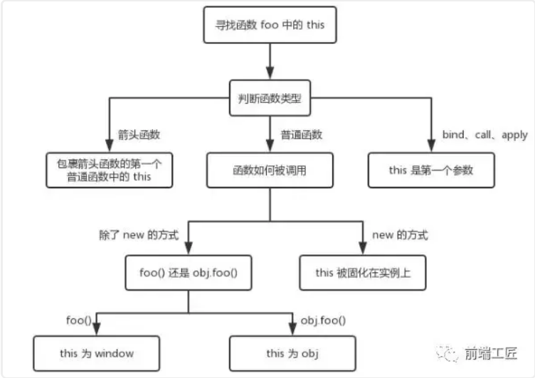

# jsc

## 变量类型

### 1.JS 的数据类型分类

分为基本数据类型和引用数据类型。其中基本数据类型包括undefined、null、Boolean、Number、String、Symbol (ES6新增，表示独一无二的值)，而引用数据类型统称为Object对象，主要包括对象、数组和函数

### 2.数据类型的判断

1. typeof

    typeof返回一个表示数据类型的字符串，返回结果包括：number、boolean、string、symbol、object、undefined、function等7种数据类型，但不能判断null、array等

    ```js
    typeof Symbol ();// symbol 有效
    typeof ''; // string 有效
    typeof 1; // number 有效
    typeof true; // boolean 有效
    typeof undefined; //undefined 有效
    typeof newFunction (); // function 有效
    typeof null; // object 无效
    typeof []; // object 无效
    typeof newDate (); // object 无效
    typeof new RegExp(); //object 无效
    ```

2. instanceof

    instanceof 是用来判断A是否为B的实例，表达式为：A instanceof B，如果A是B的实例，则返回true,否则返回false。instanceof 运算符用来测试一个对象在其原型链中是否存在一个构造函数的 prototype 属性，但它不能检测null 和 undefined

    ```js
    [] instanceof Array; //true
    {} instanceof Object; //报错
    new Date() instanceof Date; //true
    new RegExp() instanceof RegExp; //true
    null instanceof null; //报错
    undefined instanceof undefined; //报错
    ```

3. constructor

    constructor作用和instanceof非常相似。但constructor检测 Object与instanceof不一样，还可以处理基本数据类型的检测。不过函数的 constructor 是不稳定的，这个主要体现在把类的原型进行重写，在重写的过程中很有可能出现把之前的constructor给覆盖了，这样检测出来的结果就是不准确的。

4. Object.prototype.toString.call()

    Object.prototype.toString.call() 是最准确最常用的方式 返回一个字符串

    ```js
    Object.prototype.toString.call(''); // [object String]
    Object.prototype.toString.call(1); // [object Number]
    Object.prototype.toString.call(true); // [object Boolean]
    Object.prototype.toString.call(undefined); // [object Undefined]
    Object.prototype.toString.call(null); // [object Null]
    Object.prototype.toString.call(new Function()); // [object Function]
    Object.prototype.toString.call(new Date()); // [object Date]
    Object.prototype.toString.call([]); // [object Array]
    Object.prototype.toString.call(new RegExp()); // [object RegExp]
    Object.prototype.toString.call(new Error()); // [object Error]
    ```

## 浅拷贝与深拷贝

浅拷贝只复制指向某个对象的指针，而不复制对象本身，新旧对象还是共享同一块内存。

浅拷贝的实现方式（详见`https://github.com/ljianshu/Blog/issues/5`）：

- Object.assign()：需注意的是目标对象只有一层的时候，是深拷贝

- Array.prototype.concat()

- Array.prototype.slice()

深拷贝就是在拷贝数据的时候，将数据的所有引用结构都拷贝一份。简单的说就是，在内存中存在两个数据结构完全相同又相互独立的数据，将引用型类型进行复制，而不是只复制其引用关系。

深拷贝的实现方式：

- 热门的函数库lodash，也有提供_.cloneDeep用来做深拷贝

- jquery 提供一个$.extend可以用来做深拷贝

- JSON.parse(JSON.stringify())

- 手写递归方法

递归实现深拷贝的原理：要拷贝一个数据，我们肯定要去遍历它的属性，如果这个对象的属性仍是对象，继续使用这个方法，如此往复。

```js
// 定义检测数据类型的功能函数
function checkedType (target) {
    return Object.prototype.toString.call(target).slice(8, -1)
}
// 实现深度克隆---对象/数组
function clone(target) {
    // 判断拷贝的数据类型
    // 初始化变量result 成为最终克隆的数据
    let result,
        targetType = checkedType(target)
    if (targetType === "Object") {
        result = {}
    } else if (targetType === "Array") {
        target = []
    } else {
        return target
    }
    // 遍历目标数据
    for (let i in target) {
        // 获取遍历数据的每一项值
        let value = target[i]
        // 判断目标结构里的每一值是否存在对象/数组
        if (checkedType(value) === "Object" || checkedType(value) === "Array") {
            // 对象/数组里嵌套了对象/数组
            // 继续遍历获取到value值
            result[i] = clone(value)
        } else {
            // 获取到value值是基本的数据类型或函数
            result[i] = value
        }
    }
    return result
}
```

## 作用域与闭包

### 1.执行上下文和执行栈

执行上下文就是当前 JavaScript 代码被解析和执行时所在环境的抽象概念， JavaScript 中运行任何的代码都是在执行上下文中运行。
执行上下文的生命周期包括三个阶段：创建阶段→执行阶段→回收阶段，我们重点介绍创建阶段。

创建阶段（当函数被调用，但未执行任何其内部代码之前）会做以下三件事：

- 创建变量对象：首先初始化函数的参数arguments，提升函数声明和变量声明。

- 创建作用域链：下文会介绍

- 确定this指向：下文会介绍

```js
function test (arg) {
    // 1.形参是"hi"
    // 2.因为函数声明比变量声明优先级高,所以此时arg是function
    console.log(arg)
    var arg = "hello" // 3.变量声明被忽略,arg="hello"被执行
    function arg () {
        console.log("hello world")
    }
    console.log(arg)
}
test("hi")
/* 输出:
function arg () {
    console.log("hello world")
}
hello
*/
```

这是因为当函数执行的时候,首先会形成一个新的私有的作用域，然后依次按照如下的步骤执行：

- 如果有形参，先给形参赋值

- 进行私有作用域中的预解释，函数声明优先级比变量声明高，最后后者会被前者所覆盖，但是可以重新赋值

- 私有作用域中的代码从上到下执行

函数多了，就有多个函数执行上下文，每次调用函数创建一个新的执行上下文，那如何管理创建的那么多执行上下文呢？

JavaScript 引擎创建了执行栈来管理执行上下文。可以把执行栈认为是一个存储函数调用的栈结构，遵循先进后出的原则。


- JavaScript执行在单线程上，所有的代码都是排队执行。

- 一开始浏览器执行全局的代码时，首先创建全局的执行上下文，压入执行栈的顶部。

- 每当进入一个函数的执行就会创建函数的执行上下文，并且把它压入执行栈的顶部。当前函数执行完成后，当前函数的执行上下文出栈，并等待垃圾回收。

- 浏览器的JS执行引擎总是访问栈顶的执行上下文。

- 全局上下文只有唯一的一个，它在浏览器关闭时出栈。

### 2.作用域与作用域链

ES6 到来JavaScript 有全局作用域、函数作用域和块级作用域（ES6新增）。我们可以这样理解：作用域就是一个独立的地盘，让变量不会外泄、暴露出去。也就是说作用域最大的用处就是隔离变量，不同作用域下同名变量不会有冲突。

在介绍作用域链之前，先要了解下自由变量，如下代码中，console.log(a)要得到a变量，但是在当前的作用域中没有定义a（可对比一下b）。当前作用域没有定义的变量，这称为 自由变量。

```js
var a = 100
function fn () {
    var b = 200
    console.log(a) // 这里的a在这里就是一个自由变量
    console.log(b)
}
```

自由变量的值如何得到 —— 向父级作用域(创建该函数的那个父级作用域)寻找。如果父级也没呢？再一层一层向上寻找，直到找到全局作用域还是没找到，就宣布放弃。这种一层一层的关系，就是作用域链

```js
function F1 () {
    var a = 100
    return function () {
        console.log(a)
    }
}
function F2 (f1) {
    var a = 200
    console.log(f1())
}
var f1 = F1()
F2(f1)
// 100
// undefined
```

上述代码中，自由变量a的值，从函数F1中查找而不是F2,这是因为当自由变量从作用域链中去寻找，依据的是函数定义时的作用域链，而不是函数执行时。

### 3.闭包是什么

闭包这个概念也是JavaScript中比较抽象的概念，我个人理解，闭包是就是函数中的函数(其他语言不能这样),里面的函数可以访问外面函数的变量，外面的变量的是这个内部函数的一部分。

闭包的作用：

- 使用闭包可以访问函数中的变量。

- 可以使变量长期保存在内存中，生命周期比较长。

闭包不能滥用，否则会导致内存泄露，影响网页的性能。闭包使用完了后，要立即释放资源，将引用变量指向null。

闭包主要有两个应用场景：

- 函数作为参数传递（见作用域部分例子）

- 函数作为返回值（如下例）

```js
function outer () {
  var num = 0 // 内部变量
  return function add () {
    // 通过return函数返回add函数,就可以在outer函数外访问了
    num ++ // 内部函数有引用,作为add函数的一部分了
    console.log(num)
  }
}
var func1 = outer()
func1() // 1
func1() // 2
var func2 = outer()
func2() // 1
func2() // 2
```

### 4.this全面解析

**this的值是在执行的时候才能确认，定义的时候不能确认！** 为什么呢 —— 因为this是执行上下文环境的一部分，而执行上下文需要在代码执行之前确定，而不是定义的时候。看如下例子：

```js
// 情况1
function foo () {
  console.log(this.a) // 1
}
var a = 1
foo()
// 情况2
function fn () {
  console.log(this)
}
var obj = {fn: fn}
obj.fn() // this->obj
// 情况3
function createJsPerson () {
  // this是当前类的一个实例p1
  this.name = name // p1.name = name
  this.age = age // p1.age = age
}
var p1 = new createJsPerson("依依", 48)
// 情况4
// call、apply和bind：this 是第一个参数
function add (c, d) {
  return this.a + this.b + c + d
}
var o = {a: 1, b: 3}
add.call(o, 5, 7) // 1 + 3 + 5 + 7 = 16
add.apply(o, [10, 20]) // 1 + 3 + 10 + 20 = 34
```

```html
<!-- 情况5 -->
<!-- 箭头函数this指向:箭头函数没有自己的this，看其外层的是否有函数，如果有，外层函数的this就是内部箭头函数的this，如果没有，则this是window。 -->
<button id="btn1">剪头函数this</button>
<script type="text/javascript">
    let btn1 = document.getElementById("btn1")
    let obj = {
        name: "kobe",
        age: 39,
        getName: function () {
            btn1.onclick = () => {
                console.log(this) // obj
            }
        }
    }
    obj.getName();
</script>
```



## 异步

### 1.同步 vs 异步

同步，我的理解是一种线性执行的方式，执行的流程不能跨越。比如说话后在吃饭，吃完饭后在看手机，必须等待上一件事完了，才执行后面的事情。

异步，是一种并行处理的方式，不必等待一个程序执行完，可以执行其它的任务。比方说一个人边吃饭，边看手机，边说话，就是异步处理的方式。在程序中异步处理的结果通常使用回调函数来处理结果。

```js
// 同步
console.log(100)
console.log(200)
console.log(300) // 100 200 300
// 异步
console.log(100)
setTimeout(function () {
  console.log(200)
})
console.log(300) // 100 300 200
```

### 2.异步和单线程

JS 需要异步的根本原因是 JS 是单线程运行的，即在同一时间只能做一件事，不能“一心二用”。为了利用多核CPU的计算能力，HTML5提出Web Worker标准，允许JavaScript脚本创建多个线程，但是子线程完全受主线程控制，且不得操作DOM。所以，这个新标准并没有改变JavaScript单线程的本质。

一个 Ajax 请求由于网络比较慢，请求需要 5 秒钟。如果是同步，这 5 秒钟页面就卡死在这里啥也干不了了。异步的话，就好很多了，5 秒等待就等待了，其他事情不耽误做，至于那 5 秒钟等待是网速太慢，不是因为 JS 的原因。

### 3.前端异步的场景

前端使用异步的场景

- 定时任务：setTimeout，setInterval

- 网络请求：ajax请求，动态加载

- 事件绑定

### 4.Event Loop

一个完整的 Event Loop 过程，可以概括为以下阶段：


- 一开始执行栈空,我们可以把**执行栈认为是一个存储函数调用的栈结构，遵循先进后出的原则。**micro 队列空，macro 队列里有且只有一个 script 脚本（整体代码）。

- 全局上下文（script 标签）被推入执行栈，同步代码执行。在执行的过程中，会判断是同步任务还是异步任务，通过对一些接口的调用，可以产生新的 macro-task 与 micro-task，它们会分别被推入各自的任务队列里。同步代码执行完了，script 脚本会被移出 macro 队列，这个过程本质上是队列的 macro-task 的执行和出队的过程。

- 上一步我们出队的是一个 macro-task，这一步我们处理的是 micro-task。但需要注意的是：当 macro-task 出队时，任务是**一个一个**执行的；而 micro-task 出队时，任务是**一队一队**执行的。因此，我们处理 micro 队列这一步，会逐个执行队列中的任务并把它出队，直到队列被清空。

- **执行渲染操作，更新界面**

- 检查是否存在 Web worker 任务，如果有，则对其进行处理

- 上述过程循环往复，直到两个队列都清空

```js

```
